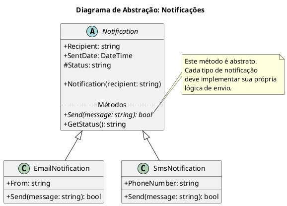
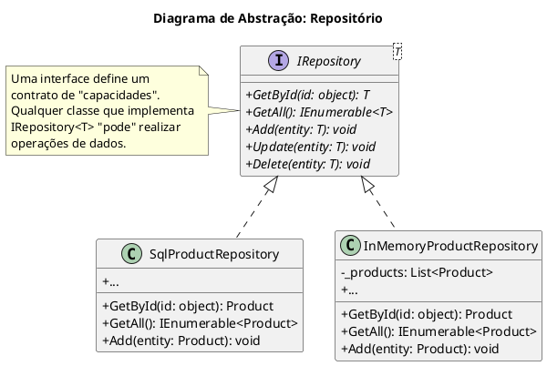

# Abstração: O Pilar da Simplicidade

A **Abstração** é um dos quatro pilares fundamentais da Programação Orientada a Objetos (OOP), ao lado do Encapsulamento, Herança e Polimorfismo. Em sua essência, o princípio da abstração consiste em **ocultar os detalhes complexos e irrelevantes de implementação, expondo apenas as funcionalidades essenciais** de um objeto ou sistema.

É um conceito que usamos o tempo todo em nosso dia a dia. Quando você dirige um carro, interage com uma interface simples: volante, pedais e câmbio. Você não precisa conhecer a mecânica da combustão interna, o funcionamento da transmissão ou a eletrônica embarcada para chegar ao seu destino. O carro, como sistema, **abstrai** toda essa complexidade para você.

Na programação, a abstração nos permite criar sistemas mais simples de usar e entender. Em vez de lidar com dezenas de operações de baixo nível, interagimos com objetos através de métodos e propriedades de alto nível, que nos fornecem o que precisamos sem nos sobrecarregar com o "como" aquilo é feito.

Em C#, a abstração é alcançada principalmente através de dois mecanismos: **Classes Abstratas** (`abstract class`) e **Interfaces** (`interface`).

## 1. Classes Abstratas (`abstract class`)

Uma classe abstrata é uma classe especial que serve como um **modelo base** para outras classes. A principal característica de uma classe abstrata é que ela **não pode ser instanciada diretamente**. Ou seja, você não pode criar um objeto a partir dela usando `new`.

Ela funciona como um contrato parcial. Pode conter tanto métodos concretos (com implementação) quanto métodos abstratos (sem implementação). As classes que herdam de uma classe abstrata são obrigadas a fornecer a implementação para todos os métodos abstratos da base.

### Exemplo do Mundo Real: Sistema de Notificações

Imagine que estamos construindo um sistema que precisa enviar diferentes tipos de notificações: E-mail, SMS e Push. Todas essas notificações compartilham características e ações comuns, mas a forma de envio de cada uma é drasticamente diferente.

Este é um cenário perfeito para uma classe abstrata `Notification`.



### Implementando em C#

Vamos traduzir o diagrama para código. Primeiro, a classe abstrata `Notification`.

```csharp
// An abstract class cannot be instantiated directly.
// It serves as a base for other classes.
public abstract class Notification
{
    // It can have properties, both abstract and concrete.
    public string Recipient { get; private set; }
    public DateTime SentDate { get; protected set; }
    protected string Status { get; set; }

    // It can have a constructor, which is called by derived classes.
    public Notification(string recipient)
    {
        Recipient = recipient;
        Status = "Pending";
    }

    // An abstract method has no implementation (no body).
    // Derived classes MUST provide an implementation for this method.
    public abstract bool Send(string message);

    // An abstract class can also have concrete methods with implementation.
    // This logic is shared among all derived classes.
    public string GetStatus()
    {
        return $"Notification to {Recipient} is currently {Status}.";
    }
}
```

Agora, as classes concretas que herdam de `Notification` e implementam o método `Send`.

```csharp
public class EmailNotification : Notification
{
    public string From { get; private set; }

    // The constructor of the derived class calls the base class constructor.
    public EmailNotification(string recipient, string from) : base(recipient)
    {
        From = from;
    }

    // We MUST override and implement the abstract method from the base class.
    public override bool Send(string message)
    {
        Console.WriteLine($"Sending EMAIL from {From} to {Recipient}: '{message}'");
        // In a real scenario, we would use an SMTP client here.
        SentDate = DateTime.UtcNow;
        Status = "Sent";
        return true;
    }
}

public class SmsNotification : Notification
{
    public string PhoneNumber { get; private set; }

    public SmsNotification(string recipientPhoneNumber) : base(recipientPhoneNumber)
    {
        PhoneNumber = recipientPhoneNumber;
    }

    public override bool Send(string message)
    {
        Console.WriteLine($"Sending SMS to {PhoneNumber}: '{message}'");
        // In a real scenario, we would use a service like Twilio here.
        SentDate = DateTime.UtcNow;
        Status = "Sent";
        return true;
    }
}
```

Com essa estrutura, a classe `Notification` define um **contrato** (`Send` deve existir) e **fornece funcionalidade comum** (`GetStatus`), enquanto as classes filhas se preocupam apenas com os detalhes específicos de sua implementação.

## 2. Interfaces (`interface`)

Uma interface é a forma mais pura de abstração. Ela é um **contrato completo**, que define um conjunto de assinaturas de métodos, propriedades, eventos ou indexadores. Uma interface **não contém nenhuma implementação**.

Se uma classe ou struct implementa uma interface, ela **garante** que fornecerá uma implementação para todos os membros definidos naquela interface.

> **Nota sobre C# 8.0+**: A partir do C# 8.0, as interfaces podem ter *implementações padrão* para métodos. Isso é um recurso avançado, usado para adicionar novos membros a interfaces existentes sem quebrar as classes que já a implementam. No entanto, o propósito primário de uma interface continua sendo a definição de um contrato sem implementação.

### Exemplo do Mundo Real: Repositório de Dados

Vamos pensar em um sistema que precisa salvar e recuperar dados. Esses dados podem vir de um banco de dados SQL Server, de um arquivo de texto, de uma API externa ou simplesmente de uma lista em memória (para testes). A lógica de negócio do nosso sistema não deveria se importar com *onde* os dados estão, apenas com o contrato de como interagir com eles: `GetById`, `GetAll`, `Add`, `Delete`.



### Implementando em C#

Primeiro, a interface `IRepository<T>`. A convenção em C# é prefixar nomes de interface com a letra `I`.

```csharp
// An interface is a pure contract. It only defines "what" a class can do,
// not "how" it does it.
// Here, we use generics (<T>) to make the repository work with any data type.
public interface IRepository<T>
{
    T GetById(Guid id);
    IEnumerable<T> GetAll();
    void Add(T entity);
    void Update(T entity);
    void Delete(T entity);
}
```

Agora, duas implementações concretas para um `Product`.

```csharp
// Dummy Product class for the example
public class Product { public Guid Id { get; set; } public string Name { get; set; } }

// Implementation using a SQL database (simulated)
public class SqlProductRepository : IRepository<Product>
{
    public void Add(Product entity)
    {
        Console.WriteLine($"SQL: Inserting product '{entity.Name}' into the database.");
    }

    // ... other methods (GetById, GetAll, etc.) would be implemented here
    // with actual database logic using Dapper, EF Core, etc.
}

// Implementation using an in-memory list (useful for tests)
public class InMemoryProductRepository : IRepository<Product>
{
    private readonly List<Product> _products = new List<Product>();

    public void Add(Product entity)
    {
        Console.WriteLine($"MEMORY: Adding product '{entity.Name}' to the in-memory list.");
        _products.Add(entity);
    }

    // ... other methods implemented here, manipulating the _products list.
}
```

O poder disso é que a nossa aplicação pode depender da interface `IRepository<T>`, e podemos "injetar" a implementação que quisermos (SQL em produção, memória em testes) sem mudar uma linha sequer da lógica de negócio. Isso é a base para **injeção de dependência** e **código de baixo acoplamento**.

## Classe Abstrata vs. Interface: Qual Usar?

Esta é uma dúvida clássica. A escolha depende do seu objetivo.

| Característica | Classe Abstrata | Interface |
| :--- | :--- | :--- |
| **Herança** | Uma classe só pode herdar de **uma** classe abstrata. | Uma classe pode implementar **múltiplas** interfaces. |
| **Conteúdo** | Pode ter implementação de métodos, campos, construtores. | Geralmente, apenas assinaturas. Define um contrato puro. |
| **Relação** | Define uma relação **"é um"**. Ex: `EmailNotification` **é uma** `Notification`. | Define uma relação **"pode fazer"**. Ex: `SqlRepository` **pode fazer** as operações de `IRepository`. |
| **Propósito** | Compartilhar código e definir um modelo base comum para classes **relacionadas**. | Definir capacidades que podem ser implementadas por classes **não relacionadas**. |

- **Use uma classe abstrata quando**: Você tem um conjunto de classes intimamente relacionadas e quer compartilhar código (lógica comum) entre elas. A classe base estabelece um parentesco forte.
- **Use uma interface quando**: Você quer definir uma capacidade que pode ser implementada por classes completamente diferentes. Por exemplo, `Carro`, `Pessoa` e `Cachorro` podem implementar a interface `IMovivel`, mas não têm uma relação de parentesco entre si.

## Conclusão

A **abstração** é uma ferramenta poderosa para gerenciar a complexidade. Ao criar abstrações com classes abstratas e interfaces, nós separamos o "o quê" (a interface pública, o contrato) do "como" (os detalhes de implementação). Isso leva a um código mais limpo, flexível, testável e de fácil manutenção, permitindo que os sistemas evoluam de forma muito mais segura e desacoplada.

> ### Referências Oficiais
> *   **[Classes Abstratas e Seladas e Membros de Classe (Guia de C#)](https://docs.microsoft.com/pt-br/dotnet/csharp/programming-guide/classes-and-structs/abstract-and-sealed-classes-and-class-members)**
> *   **[Interfaces (Guia de C#)](https://docs.microsoft.com/pt-br/dotnet/csharp/language-reference/keywords/interface)**
