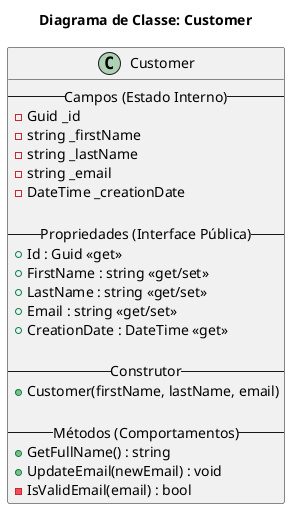

# O que é uma Classe?

No universo da Programação Orientada a Objetos (OOP), a **classe** é, sem dúvida, o conceito mais fundamental. Pense nela como uma **planta baixa** ou um **molde**. Uma planta baixa de uma casa define todas as suas características: quantos quartos terá, a localização da cozinha, o número de banheiros, e assim por diante. No entanto, a planta baixa em si não é a casa; ela é apenas o projeto para construir casas. Cada casa construída a partir daquela planta é um **objeto**.

Em C#, uma `class` é exatamente isso: um modelo para criar objetos. Ela é uma estrutura que agrupa **dados** (informações sobre o estado) e **comportamentos** (ações que podem ser executadas) em uma única unidade lógica e coesa.

Ao definir uma classe, estamos criando um novo **tipo de dado** em nosso programa. Assim como temos tipos primitivos como `int` para números inteiros e `string` para textos, podemos criar um tipo `Customer`, `Product` ou `Invoice` que representa uma entidade do mundo real ou um conceito do nosso sistema.

## Estrutura Fundamental de uma Classe

Uma classe encapsula seus membros, que podem ser campos, propriedades, métodos e eventos. Vamos visualizar a estrutura de uma classe `Customer` (Cliente) de um sistema de e-commerce usando um diagrama PlantUML.



Este diagrama nos mostra de forma clara:
- O nome da classe: `Customer`.
- Seus **campos** (representados com `-`, indicando que são `private`), que guardam o estado interno do objeto.
- Suas **propriediedades** (representadas com `+`, indicando que são `public`), que expõem os dados de forma controlada.
- Seu **construtor**, um método especial para criar o objeto.
- Seus **métodos** (também com `+` para `public` e `-` para `private`), que definem o que o objeto pode fazer.

## Anatomia de uma Classe em C#

Vamos traduzir o diagrama acima em código C# e dissecar cada parte.

```csharp
// A 'public' keyword is an access modifier. It means this class can be accessed
// from anywhere in the project.
public class Customer
{
    // Fields: These are private variables that hold the internal state of the object.
    // The underscore prefix (_) is a common convention for private fields.
    private readonly Guid _id;
    private string _firstName;
    private string _lastName;
    private string _email;
    private readonly DateTime _creationDate;

    // Properties: These are the public "gates" to the private fields.
    // They control how the data is accessed and modified. This is a core
    // principle of Encapsulation.
    public Guid Id => _id; // Expression-bodied property for read-only access
    public string FirstName
    {
        get { return _firstName; }
        set { _firstName = value; }
    }
    public string LastName
    {
        get { return _lastName; }
        set { _lastName = value; }
    }
    public string Email
    {
        get { return _email; }
        set { _email = value; }
    }
    public DateTime CreationDate => _creationDate;

    // Constructor: A special method called when a new object is created.
    // It's used to initialize the object's state.
    public Customer(string firstName, string lastName, string email)
    {
        _id = Guid.NewGuid();
        _creationDate = DateTime.UtcNow;
        _firstName = firstName;
        _lastName = lastName;
        _email = email;
    }

    // Methods: These define the actions the object can perform.
    public string GetFullName()
    {
        return $"{_firstName} {_lastName}";
    }

    public void UpdateEmail(string newEmail)
    {
        if (IsValidEmail(newEmail))
        {
            _email = newEmail;
        }
        else
        {
            // In a real application, we would throw an exception here.
            Console.WriteLine("Invalid email format.");
        }
    }

    // This is a private method. It can only be called by other members
    // of this same class. It's a helper method.
    private bool IsValidEmail(string email)
    {
        // A simple (but not perfect) email validation.
        return email.Contains("@") && email.Contains(".");
    }
}
```

### Dissecando o Código

1.  **Modificadores de Acesso (`public`)**: A palavra-chave `public` determina a "visibilidade" da classe. `public` significa que qualquer outra parte do seu código pode criar e usar objetos `Customer`. Outros modificadores incluem `internal` (visível apenas dentro do mesmo projeto/assembly) e `private` (visível apenas dentro de outra classe, no caso de classes aninhadas).

2.  **Campos (`Fields`)**: São as variáveis internas da classe. A boa prática, ligada ao pilar do **Encapsulamento**, dita que os campos devem ser `private`. Isso protege o estado interno do objeto de ser modificado de forma inesperada e inconsistente. A convenção de usar um underscore (`_`) no início do nome (`_firstName`) ajuda a diferenciar visualmente os campos privados das variáveis locais.

    > **Nota**: A palavra-chave `readonly` significa que o valor do campo só pode ser atribuído durante a sua declaração ou dentro do construtor da classe. Uma vez definido, ele não pode mais ser alterado, garantindo a imutabilidade daquele dado específico (como o `Id` e a `CreationDate` do cliente).

3.  **Propriedades (`Properties`)**: Se os campos são o cofre, as propriedades são a porta do cofre. Elas expõem publicamente os dados dos campos de uma maneira controlada. Uma propriedade tem dois blocos:
    *   `get`: É executado quando o valor da propriedade é lido. Ele retorna o valor do campo correspondente.
    *   `set`: É executado quando um valor é atribuído à propriedade. A palavra-chave `value` representa o valor que está sendo atribuído.

    No exemplo `public Guid Id => _id;`, usamos uma sintaxe mais curta, chamada *expression-bodied property*, que é útil para propriedades que são somente leitura (`read-only`) e apenas retornam o valor de um campo.

4.  **Construtor (`Constructor`)**: É um método especial que não tem tipo de retorno e possui o mesmo nome da classe. Sua função é inicializar um objeto, garantindo que ele nasça em um estado válido e consistente. No nosso exemplo, o construtor exige que um novo `Customer` seja criado já com nome, sobrenome e email, além de gerar automaticamente um `Id` e a data de criação.

5.  **Métodos (`Methods`)**: Representam os comportamentos e ações. `GetFullName()` é um método que calcula e retorna uma informação derivada do estado do objeto. `UpdateEmail(string newEmail)` é um método que modifica o estado do objeto, mas de forma controlada, validando a informação antes de aplicá-la.

## Instanciando e Usando um Objeto

Definir a classe é como desenhar a planta. Para ter a casa, precisamos construí-la. Em C#, "construir" um objeto a partir de uma classe é chamado de **instanciação**. Usamos a palavra-chave `new` para isso.

```csharp
public class Program
{
    public static void Main()
    {
        // Instantiating a new object from the Customer class.
        // We are "calling" the constructor here and passing the required arguments.
        var customer1 = new Customer("John", "Doe", "john.doe@example.com");

        // Now, 'customer1' is an object, an instance of the Customer class.
        // We can access its public properties and methods using the dot (.) operator.

        // Reading properties
        Console.WriteLine($"Customer ID: {customer1.Id}");
        Console.WriteLine($"Customer Name: {customer1.GetFullName()}"); // Using a method
        Console.WriteLine($"Original Email: {customer1.Email}");

        // Modifying state through a property
        customer1.LastName = "Smith";
        Console.WriteLine($"Updated Name: {customer1.GetFullName()}");

        // Modifying state through a method
        customer1.UpdateEmail("john.smith@newdomain.com");
        Console.WriteLine($"Updated Email: {customer1.Email}");

        // Trying to do something invalid
        customer1.UpdateEmail("invalid-email"); // The internal logic will prevent this
        Console.WriteLine($"Email after invalid update: {customer1.Email}");
    }
}
```

Neste exemplo, `customer1` é a nossa "casa". É uma entidade na memória que foi construída a partir do molde `Customer`. Ela tem sua própria cópia dos dados (`_firstName`, `_lastName`, etc.) e pode executar os comportamentos definidos na classe.

## Conclusão

A **classe** é o pilar central da Programação Orientada a Objetos em C#. Ela nos permite modelar conceitos do mundo real ou abstratos de forma organizada, segura e reutilizável. Ao agrupar estado (dados) e comportamento (métodos) em uma única unidade, as classes nos ajudam a construir sistemas complexos de maneira mais gerenciável e lógica. Dominar o conceito de classes, incluindo encapsulamento, propriedades, construtores e métodos, é o passo mais crucial para se tornar um desenvolvedor C# proficiente.

> ### Referências Oficiais
> Para um estudo mais aprofundado, consulte sempre a documentação oficial da Microsoft, que é a fonte primária de conhecimento:
> *   **[Documentação sobre Classes em C#](https://docs.microsoft.com/en-us/dotnet/csharp/programming-guide/classes-and-structs/classes)**