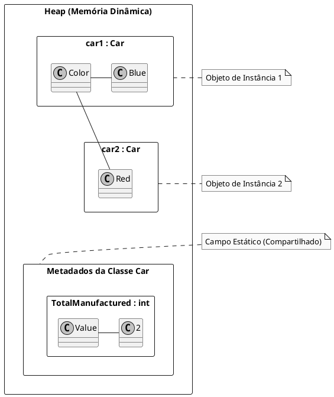

# Classes e Membros Estáticos

No mundo da Programação Orientada a Objetos, a maioria do código que escrevemos lida com **objetos**, que são **instâncias** de classes. Criamos um objeto `Carro` com a sua própria `Cor` e `VelocidadeAtual`. Criamos outro objeto `Carro` com uma `Cor` e `VelocidadeAtual` diferentes. Esses são **membros de instância**: eles pertencem a um objeto específico.

No entanto, há situações em que uma funcionalidade ou um dado não pertence a uma instância individual, mas sim à **classe como um todo**. É aqui que entra a palavra-chave `static`. 

Membros estáticos pertencem ao **tipo** em si, não a um objeto. Isso significa que existe apenas **uma única cópia** de um membro estático, que é compartilhada por toda a aplicação.

> **Dissertação**: A distinção entre estático e instância é a diferença entre "o que um objeto *é*" e "o que a categoria de objetos *sabe*". A cor de um carro é uma propriedade de *um* carro específico (instância). Já o número total de carros produzidos por uma fábrica é uma informação que pertence à fábrica como um conceito geral (estático), não a um carro individual. Entender essa diferença é crucial para modelar domínios de forma correta e decidir onde uma determinada lógica ou dado deve residir.

---

## Membros Estáticos (em Classes Não-Estáticas)

O uso mais comum da palavra-chave `static` é para criar membros estáticos dentro de uma classe normal (de instância). Você pode ter métodos, campos, propriedades e construtores estáticos.

### Métodos Estáticos: Funções Utilitárias

Um método estático é um método que pode ser chamado diretamente na classe, sem a necessidade de criar uma instância dela. Eles são ideais para funcionalidades que **não dependem do estado de um objeto específico**.

-   **Quando Usar**: Para criar funções "helper" ou utilitárias que operam apenas nos parâmetros que recebem.
-   **Exemplo Clássico**: A classe `System.Math`. Você não cria uma instância de `Math`. Você simplesmente chama `Math.Max(10, 20)` ou `Math.Sqrt(25)`. São funções puras.

#### Exemplo Prático: Validador de CPF

Imagine que precisamos de uma função para validar um CPF. Essa lógica não depende de um objeto `Pessoa` específico; ela apenas opera sobre uma string.

```c#
public class Person
{
    public string Name { get; set; }
    public string Cpf { get; set; }

    // This is an INSTANCE method. It depends on the state of a specific person object.
    public string GetWelcomeMessage()
    {
        return $"Welcome, {this.Name}!";
    }

    // This is a STATIC method. It doesn't use 'this' or any instance properties.
    // It can be called directly on the class: Person.IsCpfValid("...").
    public static bool IsCpfValid(string cpf)
    {
        // ... complex validation logic for the CPF string ...
        return true; // Placeholder
    }
}
```

### Campos e Propriedades Estáticas: Estado Compartilhado

Um campo ou propriedade estática existe como uma **única cópia** compartilhada entre todas as instâncias da classe (e de toda a aplicação).

-   **Quando Usar**: Para armazenar constantes, contadores ou qualquer estado que deva ser global para o tipo.
-   **Cuidado**: Campos estáticos mutáveis são essencialmente variáveis globais. Eles podem tornar o código difícil de testar e de raciocinar, especialmente em ambientes com múltiplas threads. Use com extrema cautela!

#### Exemplo Prático: Contador de Instâncias

```c#
public class ApiConnection
{
    // A static field to count how many connections are active.
    // It is shared across all instances.
    private static int _activeConnections = 0;

    // A public static property to expose the count in a read-only way.
    public static int ActiveConnections => _activeConnections;

    public ApiConnection()
    {
        // Increment the static counter each time a new instance is created.
        _activeConnections++;
    }

    // We should implement IDisposable to decrement the counter when the object is disposed.
    public void Dispose()
    {
        _activeConnections--;
    }
}

// Usage:
// Console.WriteLine($"Initial connections: {ApiConnection.ActiveConnections}"); // 0
// using var conn1 = new ApiConnection();
// using var conn2 = new ApiConnection();
// Console.WriteLine($"Active connections: {ApiConnection.ActiveConnections}"); // 2
```

### Construtores Estáticos

Um construtor estático é um método especial que o runtime do .NET chama **automaticamente e apenas uma vez**, antes que a classe seja usada pela primeira vez (seja criando uma instância ou acessando um membro estático). 

-   **Quando Usar**: Para inicializar campos estáticos ou realizar uma configuração única que a classe precisa para funcionar.

```c#
public class AppSettings
{
    public static readonly string DatabaseConnectionString;
    public static readonly int DefaultTimeout;

    // Static constructor. Called only once by the runtime.
    static AppSettings()
    {
        Console.WriteLine("Static constructor called: Loading settings...");
        // In a real app, this would read from a config file (appsettings.json, etc.)
        DatabaseConnectionString = "Server=myServer;Database=myDataBase;";
        DefaultTimeout = 30;
    }
}
```

---

## Classes Estáticas

Uma classe estática é uma classe que **não pode ser instanciada**. Ela serve apenas como um contêiner para membros estáticos.

As regras de uma classe estática são:
1.  É marcada com a palavra-chave `static`.
2.  **Não pode** ser instanciada com `new`.
3.  **Não pode** herdar de nenhuma outra classe (exceto `object`, implicitamente).
4.  **Todos** os seus membros devem ser `static`.

-   **Quando Usar**: Quando você tem um conjunto de funcionalidades e dados que não fazem sentido como um objeto. São puras "bibliotecas de funções".
-   **Exemplos Famosos**: `System.Math`, `System.Console`, `System.IO.File`, `System.IO.Directory`.

```c#
// A static class to hold conversion utility methods.
public static class UnitConverter
{
    private const decimal KilometersToMilesFactor = 0.621371m;

    public static decimal KilometersToMiles(decimal kilometers)
    {
        return kilometers * KilometersToMilesFactor;
    }

    public static decimal MilesToKilometers(decimal miles)
    {
        return miles / KilometersToMilesFactor;
    }
}

// Usage:
// decimal distanceInMiles = UnitConverter.KilometersToMiles(10);
```

---

## Diagrama de Memória: Instância vs. Estático

Este diagrama ilustra como os membros de instância e estáticos vivem na memória. Cada objeto `Car` tem sua própria `Color`, mas o campo `TotalManufactured` é único e pertence à definição da classe `Car`.



---

## Armadilhas e Boas Práticas

1.  **Evite Estado Estático Mutável**: Como dito antes, campos estáticos que podem ser alterados (`static int _counter`) são uma fonte comum de bugs, especialmente com paralelismo. Eles criam um acoplamento forte em todo o seu código e dificultam os testes. Prefira sempre passar o estado como parâmetros em vez de depender de um estado global.

2.  **Testabilidade**: Classes e métodos estáticos são difíceis de "mockar" em testes unitários. Você não pode facilmente substituir uma chamada a `DateTime.Now` ou a um método estático que acessa um banco de dados. Lógicas de negócio importantes geralmente devem residir em classes de instância, que podem ser gerenciadas por Injeção de Dependência e substituídas por mocks em testes.

3.  **Use Estático Para Funções Puras**: O melhor uso para métodos estáticos é para **funções puras**: aquelas que sempre produzem o mesmo resultado para os mesmos parâmetros de entrada e não têm efeitos colaterais observáveis (não alteram nenhum estado externo).

---

## Referências Oficiais da Microsoft

-   [Classes Estáticas e Membros de Classes Estáticas (Guia de Programação C#)](https://learn.microsoft.com/pt-br/dotnet/csharp/programming-guide/classes-and-structs/static-classes-and-static-class-members)
-   [`static` (Modificador) (Referência de C#)](https://learn.microsoft.com/pt-br/dotnet/csharp/language-reference/keywords/static)
