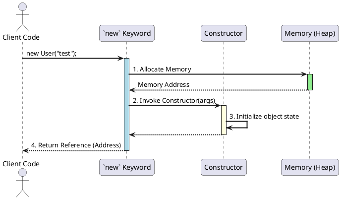

# Construtores

Em Programação Orientada a Objetos, um **Construtor** (do inglês, *Constructor*) é um método especial dentro de uma classe. Sua única e crítica responsabilidade é **inicializar um novo objeto** no momento em que ele é criado. Quando você usa a palavra-chave `new` para instanciar uma classe, é o construtor que é chamado para preparar o objeto para uso, definindo seu estado inicial e garantindo que ele "nasça" de forma válida e consistente.

> **Dissertação**: Pense no construtor como o **controle de qualidade** e a **linha de montagem inicial** de uma fábrica de objetos. Ele garante que nenhum objeto saia da linha de produção com peças faltando ou em um estado perigoso. Se uma classe `User` precisa de um `username` e `password` para ser válida, o construtor é o guardião que exige essas informações no momento da criação, impedindo a existência de um objeto `User` inválido no sistema. Um objeto nunca deve existir em um estado inconsistente, e o construtor é a principal ferramenta para garantir essa regra.

---

## A Anatomia de um Construtor

Construtores seguem regras de sintaxe bem específicas que os diferenciam de métodos comuns:

1.  O nome do construtor **deve ser exatamente o mesmo nome da classe**.
2.  Construtores **não possuem um tipo de retorno**, nem mesmo `void`.

```c#
public class User
{
    // This is a constructor for the User class.
    public User(string username)
    {
        // Initialization logic goes here.
    }
}
```

### O Processo de Instanciação (Diagrama)

O que realmente acontece quando você escreve `new User("test")`? O diagrama de sequência abaixo ilustra o processo:



---

## Padrões de Construtores em C#

Existem várias formas e padrões para se trabalhar com construtores, cada um com seu propósito.

### 1. Construtor Sem Parâmetros (Parameterless Constructor)

Este é o construtor mais básico. Ele pode existir de duas formas:

-   **Construtor Padrão (Implícito)**: Se você **não declarar nenhum construtor** em sua classe, o compilador do C# criará um para você. Este construtor é `public`, não tem parâmetros, e apenas inicializa os campos com seus valores padrão (`null`, `0`, `false`).

    ```c#
    public class SimpleLogger
    {
        // No constructor is defined here, so the compiler adds one automatically:
        // public SimpleLogger() { }
    }

    // Usage:
    // This works because the compiler provided a default public constructor.
    var logger = new SimpleLogger();
    ```

-   **Construtor Sem Parâmetros (Explícito)**: Você pode declarar seu próprio construtor sem parâmetros para executar uma lógica de inicialização específica. 

    > **Nota Importante**: No momento em que você declara **qualquer** outro construtor (com parâmetros), o compilador **não gera mais** o construtor padrão. Se você ainda quiser permitir a criação de um objeto sem passar parâmetros, deverá declarar o construtor sem parâmetros explicitamente.

    ```c#
    public class CacheService
    {
        public int CacheDurationSeconds { get; set; }

        // An explicit parameterless constructor to set a default value.
        public CacheService()
        {
            // Set a default cache duration if none is provided.
            this.CacheDurationSeconds = 60;
        }

        // A parameterized constructor.
        public CacheService(int cacheDuration)
        {
            this.CacheDurationSeconds = cacheDuration;
        }
    }

    // Usage:
    // var defaultCache = new CacheService(); // CacheDurationSeconds will be 60
    // var customCache = new CacheService(300); // CacheDurationSeconds will be 300
    ```

### 2. Construtor com Parâmetros (Parameterized Constructor)

Esta é a forma mais comum e útil. Ao exigir parâmetros, o construtor força que o objeto seja criado com os dados essenciais para seu funcionamento, garantindo seu estado válido desde o início.

```c#
public class Product
{
    public string Sku { get; private set; }

    // This constructor forces every product to be created with a SKU.
    // It's impossible to create a Product object without providing this information.
    public Product(string sku)
    {
        if (string.IsNullOrWhiteSpace(sku))
        {
            throw new ArgumentException("SKU cannot be empty.", nameof(sku));
        }
        this.Sku = sku;
    }
}
```

### 3. Sobrecarga e Encadeamento de Construtores (`: this(...)`)

Para evitar a duplicação de código entre construtores sobrecarregados (múltiplos construtores na mesma classe), um construtor pode chamar outro usando a palavra-chave `: this(...)`. Isso centraliza a lógica de inicialização.

```c#
public class DbConnection
{
    public string Server { get; private set; }
    public string Database { get; private set; }
    public int Timeout { get; private set; }

    // The "main" constructor with the most parameters, containing the core logic.
    public DbConnection(string server, string database, int timeout)
    {
        Console.WriteLine("Executing main constructor...");
        // Validation logic here...
        this.Server = server;
        this.Database = database;
        this.Timeout = timeout;
    }

    // Overload 1: This constructor calls the main one using ': this()' 
    // and provides a default value of 30 for the timeout.
    public DbConnection(string server, string database) : this(server, database, 30)
    {
        // This constructor's body can be empty because the work is delegated.
        Console.WriteLine("Executing overload with default timeout.");
    }
}
```

---

## Construtores em Cenários Avançados

### Construtores Privados e o Padrão Singleton

Se você declarar um construtor como `private`, você impede que a classe seja instanciada de fora. O uso mais clássico para isso é no **Padrão de Projeto Singleton**, que garante que exista apenas uma única instância de uma classe em toda a aplicação.

```c#
public class ApplicationSettings
{
    // A single, static, private instance of the class itself.
    private static readonly ApplicationSettings _instance = new ApplicationSettings();

    public string ApiUrl { get; private set; }

    // The constructor is private, so no one outside this class can call 'new ApplicationSettings()'.
    private ApplicationSettings()
    {
        // In a real app, this would load settings from a file.
        Console.WriteLine("Private constructor called. Loading settings...");
        ApiUrl = "https://api.example.com";
    }

    // A public static method to get the single instance.
    public static ApplicationSettings GetInstance()
    {
        return _instance;
    }
}

// Usage:
// var settings1 = new ApplicationSettings(); // COMPILE ERROR!
// var settings1 = ApplicationSettings.GetInstance();
// var settings2 = ApplicationSettings.GetInstance(); // settings2 will be the exact same object as settings1.
```

### Construtores Estáticos

Uma classe pode ter um único construtor estático (`static MyClass()`). Ele não tem modificadores de acesso nem parâmetros. Ele é executado automaticamente pelo runtime apenas **uma vez**, antes da primeira instância da classe ser criada ou qualquer membro estático ser acessado. Sua função é inicializar os **campos estáticos** da classe.

```c#
public class LogManager
{
    // A static field, shared across all parts of the application.
    private static readonly string _logFilePath;

    // The static constructor runs only once to initialize static fields.
    static LogManager()
    {
        Console.WriteLine("Static constructor called. Initializing log file path...");
        _logFilePath = $"logs/app_{DateTime.Now:yyyy-MM-dd}.log";
    }

    public static void Log(string message) { /* ... logic to write to _logFilePath ... */ }
}

// Usage:
// LogManager.Log("First message");  // Static constructor runs here.
// LogManager.Log("Second message"); // Static constructor does NOT run again.
```

### Construtores e Herança (`: base(...)`)

Em uma hierarquia de herança, o construtor de uma classe filha **deve** chamar um construtor da sua classe mãe. Isso garante que toda a cadeia de herança seja inicializada corretamente. A chamada é feita com a palavra-chave `: base(...)`.

```c#
public abstract class BaseRepository
{
    protected readonly string _connectionString;

    // The base class requires a connection string to be created.
    protected BaseRepository(string connectionString)
    {
        _connectionString = connectionString;
    }
}

public class UserRepository : BaseRepository
{
    // The derived class's constructor must call the base constructor
    // using ': base()' to pass the required connection string up the chain.
    public UserRepository(string connectionString) : base(connectionString)
    {
        // Now we can add initialization logic specific to UserRepository.
    }
}
```

---

## Referências Oficiais da Microsoft

-   [Construtores (Guia de Programação C#)](https://learn.microsoft.com/pt-br/dotnet/csharp/programming-guide/classes-and-structs/constructors)
-   [Construtores Estáticos (Guia de Programação C#)](https://learn.microsoft.com/pt-br/dotnet/csharp/programming-guide/classes-and-structs/static-constructors)
