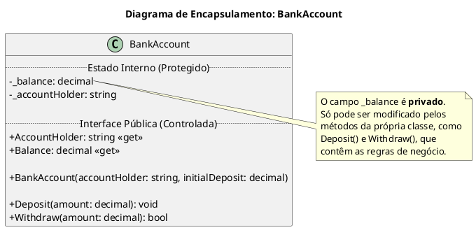

# Encapsulamento: A Cápsula Protetora do Código

O **Encapsulamento** é o segundo grande pilar da Programação Orientada a Objetos (OOP). O nome é bastante descritivo: ele se refere à prática de **agrupar dados (atributos) e os métodos (comportamentos) que operam nesses dados em uma única unidade**, a `classe`. 

Mas o encapsulamento vai além do simples agrupamento. Seu objetivo principal é **proteger o estado interno de um objeto**, restringindo o acesso direto aos seus dados. Pense nele como uma cápsula de remédio: o invólucro (a classe) protege o conteúdo (os dados) do ambiente externo. Você não interage com o pó diretamente; você consome a cápsula, que sabe como e quando liberar seu conteúdo de forma segura.

No mundo do software, isso significa que um objeto deve esconder sua complexidade interna e expor apenas as operações necessárias e seguras para o mundo exterior. Ele se torna uma "caixa-preta" responsável por gerenciar seu próprio estado.

## Por Que o Encapsulamento é Vital?

Sem encapsulamento, o estado de um objeto ficaria vulnerável. Qualquer parte do sistema poderia modificar seus dados internos, levando a inconsistências, bugs e comportamentos inesperados. 

Imagine uma classe `BankAccount` (Conta Bancária) onde o saldo é um campo público:

```csharp
// An example of what NOT to do.
public class UnsafeBankAccount
{
    // Public field - anyone can access and modify it directly.
    public decimal balance;
    public string accountHolder;
}

public class MainProgram
{
    public void Run()
    {
        var myAccount = new UnsafeBankAccount();
        myAccount.accountHolder = "John Doe";
        myAccount.balance = 100.00m;

        // Another part of the code, maybe written by another developer,
        // can do this, corrupting the object's state.
        myAccount.balance = -99999.99m; // The balance should never be negative!
    }
}
```

No exemplo acima, quebramos uma regra de negócio fundamental: o saldo de uma conta não pode ser negativo. Como o campo `balance` é público, a classe `UnsafeBankAccount` não tem **nenhum controle** sobre seu próprio estado. Ela é apenas um saco de dados passivo.

O encapsulamento resolve isso, trazendo três benefícios principais:
1.  **Integridade e Controle**: A classe passa a controlar como seus dados são acessados e modificados, permitindo a aplicação de regras de validação e lógica de negócio.
2.  **Flexibilidade e Manutenção**: A implementação interna da classe pode ser alterada sem quebrar o código que a utiliza. Desde que a "interface pública" (seus métodos e propriedades) permaneça a mesma, podemos refatorar o interior da classe com segurança.
3.  **Redução da Complexidade**: Oculta os detalhes de implementação, tornando a classe mais fácil de usar. Quem usa a classe não precisa saber *como* ela funciona por dentro, apenas *o que* ela faz.

## Alcançando o Encapsulamento em C#

Em C#, o encapsulamento é implementado através da combinação de **Modificadores de Acesso** e **Propriedades**.

### 1. Modificadores de Acesso

Eles definem o nível de "visibilidade" dos membros de uma classe.

-   `public`: O membro é acessível de qualquer lugar.
-   `private`: O membro só pode ser acessado de dentro da própria classe. **Esta é a chave para esconder os dados.**
-   `protected`: O membro pode ser acessado de dentro da própria classe e de classes que herdam dela.
-   `internal`: O membro é acessível apenas dentro do mesmo projeto (assembly).

A regra de ouro do encapsulamento é: **manter os dados (campos) `private` e expor as operações (métodos e propriedades) como `public`**. 

### 2. Propriedades (Properties)

As propriedades são a maneira idiomática do C# de expor os campos privados de forma controlada. Elas parecem campos para quem usa a classe, mas na verdade são métodos especiais (`get` e `set`).

Vamos refatorar nossa conta bancária usando os princípios do encapsulamento.



### Implementando a Classe `BankAccount` Corretamente

```csharp
public class BankAccount
{
    // 1. Data (fields) are private. The state is protected.
    private decimal _balance;
    private readonly string _accountHolder;

    // 2. Public properties provide controlled access to the data.
    // The Balance property is "read-only" to the outside world.
    // It has a 'get' accessor, but no 'set' accessor.
    public decimal Balance => _balance;

    // This property can also be made read-only from the outside.
    public string AccountHolder => _accountHolder;

    // 3. The constructor ensures the object is created in a valid state.
    public BankAccount(string accountHolder, decimal initialDeposit)
    {
        if (string.IsNullOrWhiteSpace(accountHolder))
        {
            // We can throw an exception to prevent creating an invalid object.
            throw new ArgumentException("Account holder name cannot be empty.", nameof(accountHolder));
        }

        if (initialDeposit < 0)
        {
            throw new ArgumentOutOfRangeException(nameof(initialDeposit), "Initial deposit cannot be negative.");
        }

        _accountHolder = accountHolder;
        _balance = initialDeposit;
    }

    // 4. Public methods define the valid operations that can change the object's state.
    public void Deposit(decimal amount)
    {
        if (amount <= 0)
        {
            // The class protects its own state by validating the input.
            throw new ArgumentOutOfRangeException(nameof(amount), "Deposit amount must be positive.");
        }
        _balance += amount;
    }

    public bool Withdraw(decimal amount)
    {
        if (amount <= 0)
        {
            throw new ArgumentOutOfRangeException(nameof(amount), "Withdrawal amount must be positive.");
        }

        // The class enforces its own business rules.
        if (_balance >= amount)
        {
            _balance -= amount;
            return true; // Withdrawal was successful
        }
        
        Console.WriteLine("Insufficient funds.");
        return false; // Withdrawal failed
    }
}
```

### Usando a Classe Encapsulada

Agora, o código que utiliza a classe `BankAccount` não pode mais corromper seu estado. Ele é forçado a usar a interface pública segura que a classe oferece.

```csharp
public class MainProgram
{
    public void Run()
    {
        // The object is created in a valid state through the constructor.
        var myAccount = new BankAccount("Jane Doe", 100.00m);

        Console.WriteLine($"Holder: {myAccount.AccountHolder}, Initial Balance: {myAccount.Balance:C}");

        // We interact with the object through its public methods.
        myAccount.Deposit(50.00m);
        Console.WriteLine($"Balance after deposit: {myAccount.Balance:C}");

        myAccount.Withdraw(30.00m);
        Console.WriteLine($"Balance after withdrawal: {myAccount.Balance:C}");

        // Any attempt to directly modify the balance will result in a COMPILE ERROR.
        // myAccount.Balance = 5000.00m; // <-- This line won't compile!

        // The object protects itself from invalid operations.
        try
        {
            myAccount.Deposit(-20.00m); // This will throw an exception.
        }
        catch (ArgumentOutOfRangeException ex)
        {
            Console.WriteLine($"Error: {ex.Message}");
        }

        Console.WriteLine($"Final Balance: {myAccount.Balance:C}");
    }
}
```

## Conclusão

O **Encapsulamento** é um princípio de design fundamental que torna nosso código mais **robusto, seguro e fácil de manter**. Ao tratar objetos como entidades autônomas que são responsáveis por seu próprio estado, nós criamos blocos de construção confiáveis. 

Lembre-se da regra principal: **esconda os dados, exponha os comportamentos**. Mantenha seus campos `private` e forneça acesso controlado através de propriedades `public` e métodos `public`. Ao fazer isso, você estará no caminho certo para escrever software de alta qualidade em C#.

> ### Referências Oficiais
> *   **[Propriedades (Guia de C#)](https://docs.microsoft.com/pt-br/dotnet/csharp/programming-guide/classes-and-structs/properties)**
> *   **[Modificadores de Acesso (Guia de C#)](https://docs.microsoft.com/pt-br/dotnet/csharp/programming-guide/classes-and-structs/access-modifiers)**