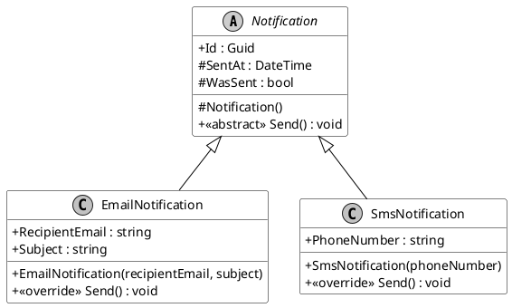

# Herança: Reutilização e Estrutura

A **Herança** é um dos quatro pilares fundamentais e mais poderosos da Programação Orientada a Objetos (POO). Em sua essência, a herança é um mecanismo que permite a uma nova classe — que chamamos de *classe filha* ou *derivada* — ser baseada em uma classe já existente — a *classe mãe* ou *base*. Ao fazer isso, a classe derivada **herda (adquire) todos os membros públicos e protegidos** (atributos e métodos) da classe base, como se fossem seus.

O conceito central que a herança modela no mundo do software é o relacionamento **"é um(a)"**. Esta não é apenas uma frase bonita, é a verificação lógica que você deve fazer ao decidir usar herança. Por exemplo:

-   Um `Gerente` **é um** `Funcionario`.
-   Um `Carro` **é um** `Veiculo`.
-   Uma `EmailNotification` **é uma** `Notification`.

Essa estruturação não se trata apenas de copiar e colar código. Trata-se de estabelecer uma **relação formal, lógica e forte entre os tipos** do seu sistema. Isso permite criar hierarquias de classes que são intuitivas, fáceis de manter e, crucialmente, que abrem as portas para o polimorfismo.

---

## Os Pilares da Motivação para Herança

Por que nos damos ao trabalho de criar essas hierarquias? A herança não é apenas um recurso da linguagem; ela resolve problemas fundamentais da engenharia de software.

1.  **Reutilização de Código (Code Reusability)**
    Este é o benefício mais imediato e óbvio. Em vez de duplicar lógica em múltiplas classes, você a centraliza na classe base. Imagine que você tem as classes `Cliente`, `Funcionario` e `Fornecedor`. Todas elas precisam de `Id`, `Nome` e `DataDeCadastro`. Em vez de repetir esses três campos em cada classe, você pode criar uma classe base `Pessoa` que os contenha. `Cliente`, `Funcionario` e `Fornecedor` então herdam de `Pessoa` e reutilizam essa estrutura.

    > **Dissertação**: A verdadeira vitória aqui não é apenas digitar menos. É criar uma **única fonte de verdade** (*Single Source of Truth*). Se, no futuro, você decidir que todo `Id` deve ser um `Guid` em vez de um `int`, ou que a lógica de validação do `Nome` precisa mudar, você altera isso em *um único lugar*: a classe `Pessoa`. Todas as classes filhas instantaneamente herdam a melhoria. Isso reduz drasticamente o custo de manutenção e a probabilidade de bugs.

2.  **Organização e Modelagem do Domínio (Domain Modeling)**
    A herança permite que a estrutura do seu código espelhe a estrutura do problema do mundo real que você está tentando resolver (o seu "domínio"). Se você está construindo um software para uma transportadora, seu código terá classes como `Veiculo`, `Caminhao`, `Van`, `Carro`, formando uma hierarquia que qualquer pessoa da empresa consegue entender. O código se torna um **modelo** do negócio, tornando-o mais fácil de raciocinar, discutir e evoluir.

3.  **Habilitação do Polimorfismo (Enabling Polymorphism)**
    A herança é a fundação sobre a qual o pilar do Polimorfismo é construído. Como uma `EmailNotification` **é uma** `Notification`, a herança permite que você trate um objeto da classe filha como se ele fosse um objeto da classe mãe. Isso significa que você pode, por exemplo, criar uma lista de `Notification` (`List<Notification>`) e adicionar nela objetos dos tipos `EmailNotification`, `SmsNotification` e `PushNotification`.

    > **Nota**: O Polimorfismo é um tópico próprio e igualmente importante, mas é impossível justificar a herança sem mencionar que ela é o que torna o polimorfismo possível. A capacidade de escrever código genérico que opera sobre uma classe base, e confiar que o comportamento correto da classe derivada será executado, é uma das técnicas mais poderosas em POO.

---

## Diagramando a Herança com PlantUML

Visualizar a hierarquia de classes é uma forma excelente de entender a estrutura do código antes mesmo de escrevê-lo. Usaremos a ferramenta **PlantUML** para desenhar a hierarquia do nosso exemplo prático: um sistema de notificações.



**Interpretando o Diagrama:**

-   `abstract class Notification`: A palavra-chave `abstract` e o nome em *itálico* indicam que `Notification` é uma classe conceitual que não pode ser instanciada diretamente.
-   `+`, `#`: Indicam os modificadores de acesso. `+` é `public` (totalmente visível) e `#` é `protected` (visível para a classe e suas filhas).
-   `<<abstract>>` e `<<override>>`: São "estereótipos" que nos dão mais informações sobre os métodos. `<<abstract>>` indica um método que deve ser implementado, e `<<override>>` indica um método que está fornecendo essa implementação.
-   `Notification <|-- EmailNotification`: Esta é a representação visual da herança. A seta de triângulo vazia aponta da classe filha para a classe mãe. Leia-se: "EmailNotification herda de Notification".

---

## Implementando Herança em C#: Uma Análise Técnica

Agora, vamos traduzir o diagrama e os conceitos para código C#, explicando cada palavra-chave envolvida.

### A Sintaxe de Herança: O Operador `:`

Para declarar que uma classe herda de outra, você usa o operador de dois pontos (`:`) após o nome da classe filha, seguido pelo nome da classe mãe.

`public class EmailNotification : Notification`

Esta simples linha estabelece formalmente que `EmailNotification` **é uma** `Notification` e herda seus membros.

### Palavras-chave Essenciais para Herança

| Palavra-chave | Propósito na Classe Mãe | Propósito na Classe Filha |
| :--- | :--- | :--- |
| **`abstract`** | Declara que a classe é um conceito e não pode ser instanciada. Pode conter métodos `abstract` (sem corpo). | - |
| **`virtual`** | Declara um método com uma implementação padrão, mas que *pode* ser sobrescrito pelas classes filhas. | - |
| **`override`** | - | Fornece uma nova implementação para um método `abstract` ou `virtual` da classe mãe. |
| **`protected`** | Declara um membro que é `private` para o mundo exterior, mas `public` para qualquer classe filha. | Permite o acesso a membros `protected` da classe mãe. |
| **`base`** | - | Usado para acessar membros da classe mãe, seja seu construtor (`: base()`) ou seus métodos (`base.Metodo()`). |
| **`sealed`** | - | Declara que a classe não pode mais ser herdada por nenhuma outra classe. Ela encerra a cadeia de herança. |

### Exemplo Prático: O Código do Sistema de Notificações

Este código implementa exatamente o que foi projetado no diagrama PlantUML.

```c#
// using System; // Required for Guid, DateTime, etc.
// using System.Collections.Generic; // Required for List<T>

// THE ABSTRACT BASE CLASS
// 'abstract' means this class is a concept and cannot be created directly.
// E.g., you cannot do 'new Notification()'.
public abstract class Notification
{
    // A Guid (Globally Unique Identifier) is a 128-bit almost-unique number,
    // ideal for use as a database ID.
    public Guid Id { get; private set; }

    // 'protected' means this member can only be accessed by this class
    // or by classes that inherit from it (EmailNotification, SmsNotification).
    protected DateTime SentAt { get; set; }
    protected bool WasSent { get; set; }

    // Protected constructor. Can only be called by this class or its derivatives.
    protected Notification()
    {
        Id = Guid.NewGuid();
        WasSent = false;
    }

    // An 'abstract' method is a contract. It has no implementation here.
    // Every derived class IS FORCED to implement its own version of this method.
    public abstract void Send();
}

// A DERIVED CLASS
public class EmailNotification : Notification // Inheritance happens here
{
    public string RecipientEmail { get; private set; }
    public string Subject { get; private set; }

    public EmailNotification(string recipientEmail, string subject)
    {
        // Note that the base class constructor (Notification) is called implicitly here.
        RecipientEmail = recipientEmail;
        Subject = subject;
    }

    // 'override' fulfills the contract defined by the 'abstract' method in the parent class.
    // This is the SPECIFIC implementation of Send() for an email.
    public override void Send()
    {
        Console.WriteLine($"Sending email to '{RecipientEmail}' with subject '{Subject}'.");
        // The derived class can access the 'protected' members of the base class.
        this.SentAt = DateTime.UtcNow;
        this.WasSent = true;
        Console.WriteLine("Email sent successfully.");
    }
}

// ANOTHER DERIVED CLASS
public class SmsNotification : Notification
{
    public string PhoneNumber { get; private set; }

    // Here we explicitly call the base class constructor with ': base()'
    // It's not strictly necessary in this case, but it's good practice to be clear.
    public SmsNotification(string phoneNumber) : base()
    {
        PhoneNumber = phoneNumber;
    }

    public override void Send()
    {
        Console.WriteLine($"Sending SMS to '{this.PhoneNumber}'.");
        this.SentAt = DateTime.UtcNow;
        this.WasSent = true;
        Console.WriteLine("SMS sent successfully.");
    }
}

public class NotificationService
{
    public static void Main()
    {
        var email = new EmailNotification("test@example.com", "Your order has shipped!");
        var sms = new SmsNotification("+1234567890");

        // Inheritance allows us to use Polymorphism.
        // We create a list of the BASE class, but we populate it with CHILD classes.
        var notificationsToSend = new List<Notification> { email, sms };

        Console.WriteLine("--- Processing notifications ---");
        foreach (var notification in notificationsToSend)
        {
            // The correct version of .Send() is called for each object!
            notification.Send();
            Console.WriteLine("--------------------------------");
        }
    }
}
```

> **Nota sobre Herança Múltipla**: Diferente de algumas outras linguagens (como C++), o C# **não permite herança múltipla de classes**. Uma classe só pode herdar diretamente de uma única classe base. Isso é uma decisão de design para evitar um problema complexo chamado "Problema do Diamante". A funcionalidade de herança múltipla em C# é alcançada através de **Interfaces**, que permitem que uma classe "assine múltiplos contratos".

---

## Referências Oficiais da Microsoft

Para um estudo ainda mais aprofundado, a documentação oficial é a melhor fonte de informação.

-   [Herança (Guia de Programação C#)](https://learn.microsoft.com/pt-br/dotnet/csharp/fundamentals/object-oriented/inheritance)
-   [Palavra-chave `abstract`](https://learn.microsoft.com/pt-br/dotnet/csharp/language-reference/keywords/abstract)
-   [Palavras-chave `virtual` e `override`](https://learn.microsoft.com/pt-br/dotnet/csharp/language-reference/keywords/virtual)