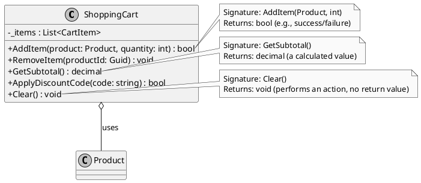

# Métodos

Se as Propriedades representam o *estado* de um objeto (seus dados, suas características), os **Métodos** representam seu **comportamento**. Eles são os *verbos* da Programação Orientada a Objetos, os blocos de código que executam ações, manipulam o estado e, em última análise, fazem o trabalho do seu programa. Um método encapsula uma série de instruções sob um único nome, permitindo que essa lógica seja reutilizada e invocada de forma clara e organizada.

> **Dissertação**: Pense em um objeto `Email`. Seu estado (propriedades) seria o `Destinatario`, o `Assunto` e o `CorpoDoEmail`. Mas o email por si só é inerte. É o método `Enviar()` que contém a lógica complexa de se conectar a um servidor SMTP, autenticar, transmitir os dados e tratar possíveis erros. O método é onde a lógica de negócio reside. Ele age sobre o estado do objeto (`Destinatario`, `Assunto`) para realizar uma tarefa significativa. Dominar a criação de métodos claros, coesos e bem definidos é essencial para construir qualquer aplicação funcional.

---

## A Anatomia de um Método

Para usar métodos de forma eficaz, é crucial entender cada parte de sua declaração, conhecida como sua **assinatura** e corpo.

Vamos dissecar um exemplo do mundo real: um método para adicionar um item a um carrinho de compras.

`public bool AddItem(Product product, int quantity)`

1.  **Modificador de Acesso (`public`)**: Define a visibilidade do método. `public` significa que ele pode ser chamado de qualquer lugar do seu código. Outras opções comuns são `private` (só pode ser chamado de dentro da mesma classe) e `protected` (pode ser chamado pela classe e suas derivadas).

2.  **Tipo de Retorno (`bool`)**: Especifica o tipo de dado que o método irá **retornar** após sua execução ser concluída. Neste caso, um `bool` (booleano) poderia indicar se o item foi adicionado com sucesso (`true`) ou não (`false`). Se um método não retorna nenhum valor, usamos a palavra-chave `void`.

3.  **Nome do Método (`AddItem`)**: Um nome descritivo e, por convenção, baseado em um verbo, que indica a ação que o método realiza.

4.  **Lista de Parâmetros (`(Product product, int quantity)`)**: Define os dados de entrada que o método precisa para executar sua tarefa. Cada parâmetro tem um tipo (ex: `Product`) e um nome (ex: `product`). A combinação do nome do método e dessa lista de parâmetros forma a **assinatura** única do método.

5.  **Corpo do Método (`{...}`)**: O bloco de código entre chaves que contém as instruções a serem executadas quando o método é chamado.

### Diagrama de Métodos (PlantUML)

Este diagrama ilustra uma classe `ShoppingCart` e destaca a anatomia de seus métodos.



---

## Passando Dados para Métodos: Uma Análise Profunda

A maneira como os dados fluem para dentro de um método é um dos conceitos mais importantes para se dominar em C#. A escolha do modificador de parâmetro correto afeta não apenas o comportamento do método, mas também a performance e a clareza do código. Vamos dissecar cada tipo com exemplos práticos.

### O Comportamento Padrão: Passagem por Valor

Este é o comportamento padrão em C#. Quando você passa um argumento para um método, uma **cópia** do valor desse argumento é criada e passada para o parâmetro do método. O que isso significa na prática depende se o tipo é um **Tipo de Valor** (`struct`, `int`, `bool`, etc.) ou um **Tipo de Referência** (`class`, `string`, `array`, etc.).

#### Passando Tipos de Valor (ex: `int`, `struct`)

Uma cópia completa do valor é feita. Qualquer alteração no parâmetro dentro do método **não afeta** a variável original.

```c#
public void Square(int number)
{
    // 'number' is a copy of the original 'myValue'.
    number = number * number;
    Console.WriteLine($"Inside method: {number}");
}

public void Test()
{
    int myValue = 5;
    Console.WriteLine($"Before method: {myValue}");
    Square(myValue);
    Console.WriteLine($"After method: {myValue}");
}

// Output:
// Before method: 5
// Inside method: 25
// After method: 5 
```
> **Análise**: Observe que `myValue` permaneceu `5` após a chamada do método. A variável `number` dentro de `Square` era uma cópia completamente independente.

#### Passando Tipos de Referência (ex: `class`)

Aqui a situação é mais sutil e uma fonte comum de confusão. O que é passado por valor (copiado) é a **referência** ao objeto, não o objeto em si. Ambas as variáveis (a original e o parâmetro) apontam para o **mesmo objeto na memória**.

Isso significa que:
1.  Se você **alterar uma propriedade do objeto** dentro do método, a alteração **será visível** fora, pois o objeto é o mesmo.
2.  Se você **atribuir um novo objeto** ao parâmetro (`param = new MyClass()`), isso **não afetará** a variável original. Você está apenas fazendo o parâmetro (a cópia da referência) apontar para um novo lugar.

```c#
public class Score
{
    public int Value { get; set; }
}

public void ModifyScore(Score score)
{
    // 1. This change WILL be visible outside, because we are modifying
    // the object that the reference points to.
    score.Value = 100;

    // 2. This change WILL NOT be visible outside. We are changing the
    // parameter (the copied reference) to point to a new object.
    // The original variable still points to the old object.
    score = new Score { Value = 999 };
    Console.WriteLine($"Inside method, after new: {score.Value}");
}

public void Test()
{
    var myScore = new Score { Value = 10 };
    Console.WriteLine($"Before method: {myScore.Value}");
    ModifyScore(myScore);
    Console.WriteLine($"After method: {myScore.Value}");
}

// Output:
// Before method: 10
// Inside method, after new: 999
// After method: 100
```
> **Análise**: O valor final de `myScore.Value` é `100`, provando que a alteração na propriedade do objeto original foi bem-sucedida. A reatribuição para um `new Score` dentro do método foi irrelevante para a variável `myScore`.

### Modificador `ref`: Passando por Referência

Ao usar `ref`, você não passa mais uma cópia. Você passa a **própria referência da variável original**. É como dar ao método o endereço de memória da sua variável. Qualquer alteração feita no parâmetro, seja no valor/propriedade ou uma reatribuição, **afetará diretamente a variável original**.

- A variável **deve** ser inicializada antes de ser passada.
- Tanto na chamada quanto na declaração do método, a palavra-chave `ref` deve ser usada.

```c#
public void DoubleValue(ref int number)
{
    // This now modifies the original variable.
    number = number * 2;
}

public void Test()
{
    int myValue = 5;
    Console.WriteLine($"Before: {myValue}");
    DoubleValue(ref myValue);
    Console.WriteLine($"After: {myValue}");
}

// Output:
// Before: 5
// After: 10
```
> **Uso**: Use `ref` com moderação. Geralmente é preferível que um método retorne um valor em vez de modificar seus parâmetros de entrada. É útil em cenários de alta performance ou ao trabalhar com APIs mais antigas.

### Modificador `out`: Parâmetros de Saída

O `out` é muito similar ao `ref`, mas com duas diferenças cruciais:
1.  A variável passada para um parâmetro `out` **não precisa** ser inicializada antes da chamada.
2.  O método que recebe um parâmetro `out` é **obrigado** a atribuir um valor a ele antes de retornar.

É o padrão da indústria para métodos que precisam retornar múltiplos valores. O exemplo clássico é o padrão `Try...`.

```c#
public bool TryParseDate(string text, out DateTime result)
{
    // The method MUST assign a value to 'result' before it exits.
    try
    {
        result = DateTime.Parse(text);
        return true;
    }
    catch (FormatException)
    {
        result = default; // Assign a default value on failure.
        return false;
    }
}

public void Test()
{
    string dateString = "2025-08-27";
    // The 'parsedDate' variable doesn't need to be initialized.
    if (TryParseDate(dateString, out DateTime parsedDate))
    {
        Console.WriteLine($"Successfully parsed: {parsedDate.ToShortDateString()}");
    }
    else
    {
        Console.WriteLine("Failed to parse the date.");
    }
}

// Output:
// Successfully parsed: 27/08/2025
```
> **Análise**: O método `TryParseDate` consegue comunicar duas coisas: o sucesso da operação (através do `bool` de retorno) e o resultado da operação (através do parâmetro `out`).

### Modificador `in`: Parâmetros de Entrada Somente Leitura

Introduzido em versões mais recentes do C#, o `in` é o oposto do `out`. Ele também passa o argumento por referência (evitando cópias), mas garante que o método **não pode modificar** o valor.

Seu principal caso de uso é um **ganho de performance** ao passar `structs` grandes. Copiar um `struct` grande pode ser custoso; passá-lo com `in` envia apenas uma referência, de forma muito mais rápida, com a segurança de que ele não será alterado.

```c#
// Imagine this is a very large struct.
public readonly struct Point3D
{
    public double X { get; }
    public double Y { get; }
    public double Z { get; }

    public Point3D(double x, double y, double z)
    {
        X = x; Y = y; Z = z;
    }
}

// By using 'in', we avoid copying the Point3D struct.
public void PrintPoint(in Point3D point)
{
    // The method can read the point's data.
    Console.WriteLine($"({point.X}, {point.Y}, {point.Z})");

    // But any attempt to modify it would cause a COMPILE ERROR.
    // point = new Point3D(0,0,0); // Error!
    // point.X = 10; // Error (also because property is readonly, but 'in' enforces it)
}
```

### Modificador `params`: Array de Parâmetros

A palavra-chave `params` permite que um método aceite um **número variável de argumentos**.
- Só pode haver um `params` por método.
- Ele deve ser o **último** parâmetro na assinatura do método.
- Os argumentos passados são agrupados em um array dentro do método.

```c#
// This method can accept any number of integers.
public double CalculateAverage(params int[] numbers)
{
    if (numbers == null || numbers.Length == 0)
    {
        return 0;
    }
    
    double sum = 0;
    foreach (var number in numbers)
    {
        sum += number;
    }
    return sum / numbers.Length;
}

public void Test()
{
    // You can call it with multiple arguments...
    double avg1 = CalculateAverage(10, 20, 30);
    Console.WriteLine($"Average 1: {avg1}");

    // ...with a single argument...
    double avg2 = CalculateAverage(99);
    Console.WriteLine($"Average 2: {avg2}");

    // ...or with no arguments.
    double avg3 = CalculateAverage();
    Console.WriteLine($"Average 3: {avg3}");
}

// Output:
// Average 1: 20
// Average 2: 99
// Average 3: 0
```

### Parâmetros Opcionais e Nomeados

**Parâmetros Opcionais** permitem que você defina um valor padrão para um parâmetro na assinatura do método. Se o chamador não fornecer um argumento para ele, o valor padrão é usado. Eles devem vir depois de todos os parâmetros obrigatórios.

**Parâmetros Nomeados** permitem que você especifique o nome do parâmetro ao passar o argumento. Isso melhora a legibilidade e permite passar argumentos fora de ordem, o que é especialmente útil com parâmetros opcionais.

```c#
public void CreateUser(string username, string role = "User", bool isActive = true)
{
    Console.WriteLine($"Creating user '{username}' with role '{role}' and status '{(isActive ? "Active" : "Inactive")}'.");
}

public void Test()
{
    // 1. Using all default parameters
    CreateUser("john.doe");

    // 2. Providing one optional parameter
    CreateUser("jane.doe", "Administrator");

    // 3. Using named parameters to skip one and improve readability
    CreateUser(username: "super.user", isActive: false);
    
    // 4. Using named parameters out of order
    CreateUser(isActive: true, role: "Guest", username: "guest.user");
}

// Output:
// Creating user 'john.doe' with role 'User' and status 'Active'.
// Creating user 'jane.doe' with role 'Administrator' and status 'Active'.
// Creating user 'super.user' with role 'User' and status 'Inactive'.
// Creating user 'guest.user' with role 'Guest' and status 'Active'.
```

---

## Sobrecarga de Métodos (Method Overloading)

A sobrecarga é a capacidade de definir, na mesma classe, múltiplos métodos com o **mesmo nome**, desde que suas **assinaturas sejam diferentes** (ou seja, a quantidade ou o tipo dos parâmetros sejam diferentes).

Isso é extremamente útil para fornecer maneiras mais convenientes de chamar uma mesma ação.

```c#
public class ShoppingCart
{
    // Overload 1: The main method
    public void AddItem(Product product, int quantity)
    {
        Console.WriteLine($"Adding {quantity} of '{product.Name}'.");
        // ... logic ...
    }

    // Overload 2: A convenience method. If quantity is not provided, it defaults to 1.
    public void AddItem(Product product)
    {
        // It calls the other overload to avoid duplicating code.
        AddItem(product, 1);
    }

    // Overload 3: Another convenience method. Finds the product by its ID first.
    public void AddItem(Guid productId, int quantity)
    {
        // In a real system, we would fetch the product from a database.
        Product product = FindProductById(productId);
        if (product != null)
        {
            AddItem(product, quantity);
        }
    }

    private Product FindProductById(Guid id) { /* ... database logic ... */ return new Product(); }
    public class Product { public string Name { get; set; } }
}
```

---

## Exemplo Prático Completo

```c#
public class Order
{
    public Guid Id { get; private set; }
    public List<string> Items { get; private set; }
    public decimal TotalAmount { get; private set; }
    public bool IsShipped { get; private set; }

    public Order()
    {
        Id = Guid.NewGuid();
        Items = new List<string>();
        TotalAmount = 0;
        IsShipped = false;
    }

    // A simple method to add an item and update the total.
    public void AddItem(string itemName, decimal price, int quantity = 1)
    {
        if (IsShipped)
        {
            Console.WriteLine("Error: Cannot modify a shipped order.");
            return;
        }
        Items.Add($"{itemName} (x{quantity})");
        TotalAmount += price * quantity;
        Console.WriteLine($"Added '{itemName}'. Subtotal is now {TotalAmount:C}.");
    }

    // A method that uses an 'out' parameter.
    public bool TryApplyDiscount(string discountCode, out decimal discountAmount)
    {
        discountAmount = 0;
        if (discountCode == "SAVE10")
        {
            discountAmount = TotalAmount * 0.10m;
            TotalAmount -= discountAmount;
            return true; // Success
        }
        return false; // Failure
    }

    // A method that changes the state of the object.
    public void ShipOrder()
    {
        if (Items.Count == 0)
        {
            Console.WriteLine("Error: Cannot ship an empty order.");
            return;
        }
        IsShipped = true;
        Console.WriteLine($"Order {Id} has been shipped.");
    }
}

public class OrderProcessing
{
    public static void Main()
    {
        var order = new Order();
        order.AddItem("Laptop", 1500.00m);
        order.AddItem("Mouse", 75.50m, 2); // Using the optional parameter

        // Using the method with an 'out' parameter
        if (order.TryApplyDiscount("SAVE10", out decimal appliedDiscount))
        {
            Console.WriteLine($"Applied a discount of {appliedDiscount:C}. New total: {order.TotalAmount:C}");
        }

        order.ShipOrder();
        order.AddItem("Keyboard", 120.00m); // This will fail because the order is shipped.
    }
}
```

> **Nota sobre Métodos de Extensão**: C# tem um recurso poderoso chamado *métodos de extensão*, que permite "adicionar" novos métodos a tipos existentes sem alterar seu código-fonte original. Por exemplo, você poderia criar um método `string.IsEmail()` que poderia ser chamado em qualquer string. Eles são amplamente utilizados no LINQ.

> **Nota sobre Métodos Estáticos**: Os métodos que vimos são *métodos de instância*, pois operam sobre o estado de um objeto específico (`order.ShipOrder()`). Existem também os *métodos estáticos*, que pertencem à classe em si e não a uma instância. Eles são chamados diretamente na classe (ex: `Math.Max(5, 10)`) e não podem acessar o estado de uma instância (como a propriedade `TotalAmount`).

---

## Referências Oficiais da Microsoft

-   [Métodos (Guia de Programação C#)](https://learn.microsoft.com/pt-br/dotnet/csharp/programming-guide/classes-and-structs/methods)
-   [Passando Parâmetros (Guia de Programação C#)](https://learn.microsoft.com/pt-br/dotnet/csharp/programming-guide/classes-and-structs/passing-parameters)
-   [Sobrecarga de Método (Guia de C#)](https://learn.microsoft.com/pt-br/dotnet/csharp/language-reference/proposals/csharp-7.2/method-overloading-improvements)
