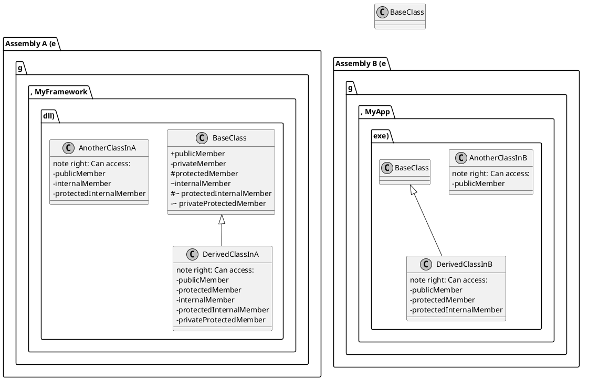

# Modificadores de Acesso

Os **Modificadores de Acesso** (*Access Modifiers*) são palavras-chave do C# que definem a **visibilidade** e o **nível de acesso** de tipos (classes, structs, interfaces, etc.) e de seus membros (métodos, propriedades, campos). Eles são os porteiros do seu código, determinando quem pode ver e interagir com cada parte da sua aplicação.

Dominar os modificadores de acesso é fundamental para praticar o **Encapsulamento**, um dos pilares da Programação Orientada a Objetos. O encapsulamento consiste em ocultar os detalhes internos de implementação de um objeto e expor apenas o que é estritamente necessário para a sua utilização. Isso protege a integridade dos dados, reduz a complexidade e facilita a manutenção e evolução do software.

> **Dissertação**: Pense em uma classe como uma caixa-preta. Os modificadores de acesso permitem que você, como designer da classe, decida quais botões, alavancas e visores estarão do lado de fora (a interface pública) e quais engrenagens, fios e circuitos ficarão escondidos do lado de dentro (a implementação privada). Sem eles, todo o mecanismo interno estaria exposto, e qualquer um poderia mexer nas engrenagens, quebrando o sistema de formas imprevisíveis. Os modificadores são a ferramenta que nos permite criar componentes robustos, confiáveis e fáceis de usar, pois eles definem um **contrato claro** sobre como um objeto deve ser utilizado.

Em C#, temos os seguintes modificadores de acesso:

-   `public`
-   `private`
-   `protected`
-   `internal`
-   `protected internal`
-   `private protected`

---

## `public`: A Porta da Frente

O modificador `public` é o nível de acesso mais permissivo. Um membro `public` não tem nenhuma restrição de acesso. Ele pode ser acessado por qualquer código, em qualquer classe, de qualquer assembly (projeto).

-   **Analogia do Mundo Real**: A fachada de uma loja, o menu de um restaurante ou um parque público. São feitos para serem vistos e utilizados por todos.
-   **Quando Usar**: Use `public` para os membros que definem a **API pública** do seu tipo. São os métodos e propriedades que outros desenvolvedores (ou outras partes do seu próprio sistema) usarão para interagir com sua classe. 

### Exemplo Prático: DTO e Controladores

Em uma aplicação web, as classes de *Data Transfer Object* (DTO) e os métodos de um *Controller* são quase sempre `public`, pois precisam ser acessados pelo framework (ASP.NET Core), por outras camadas da aplicação ou até mesmo serializados para clientes externos.

```c#
// This DTO class is public so it can be used across different projects
// (e.g., in the Web API project and in a client application project).
public class UserViewModel
{
    public int Id { get; set; }
    public string FullName { get; set; }
    public string Email { get; set; }
}

// This controller method is public to be accessible by the ASP.NET Core routing system.
public class UsersController : ControllerBase
{
    [HttpGet("{id}")]
    public ActionResult<UserViewModel> GetUserById(int id)
    {
        // ... logic to find user and return a UserViewModel
        var user = new UserViewModel { Id = id, FullName = "Alice Smith", Email = "alice@example.com" };
        return Ok(user);
    }
}
```

---

## `private`: O Cofre Interno

O modificador `private` é o nível de acesso mais restritivo. Um membro `private` só pode ser acessado de dentro da **mesma classe** (ou struct) que o declara. Nem mesmo classes derivadas (filhas) podem acessá-lo.

-   **Analogia do Mundo Real**: Um diário pessoal, os pensamentos na sua cabeça ou o mecanismo interno de um relógio suíço. São detalhes íntimos, não destinados ao mundo exterior.
-   **Quando Usar**: Use `private` para todos os membros que são **detalhes de implementação**. Campos que armazenam o estado interno, métodos auxiliares que realizam cálculos complexos, etc. A regra de ouro do encapsulamento é: **comece com `private` e só aumente a visibilidade se for realmente necessário.**

> **Nota**: Se você não especificar nenhum modificador de acesso para um membro de uma classe ou struct, o padrão é `private`. Esta é uma escolha de design deliberada do C# para favorecer o encapsulamento por padrão.

### Exemplo Prático: Campo de Apoio e Método Auxiliar

```c#
public class BankAccount
{
    // The backing field for the balance is private to protect it from direct, uncontrolled modification.
    private decimal _balance;

    // The public property provides controlled access.
    public decimal Balance
    {
        get { return _balance; }
    }

    public void Deposit(decimal amount)
    {
        if (amount <= 0)
        {
            throw new ArgumentException("Deposit amount must be positive.");
        }
        _balance += amount;
        LogTransaction("Deposit", amount);
    }

    // This is a private helper method. Its only purpose is to serve the public methods
    // of this class. It's an implementation detail and should not be called from outside.
    private void LogTransaction(string type, decimal amount)
    {
        Console.WriteLine($"[LOG] Transaction: {type}, Amount: {amount:C}, New Balance: {_balance:C}");
    }
}
```

---

## `protected`: O Segredo de Família

O modificador `protected` está ligado à herança. Um membro `protected` pode ser acessado de dentro da mesma classe que o declara e também por qualquer **classe derivada (filha)**, mesmo que essa classe filha esteja em outro assembly.

-   **Analogia do Mundo Real**: Uma receita de família que é passada de pais para filhos. Apenas os membros da família (classes na mesma hierarquia de herança) têm acesso a ela.
-   **Quando Usar**: Use `protected` quando você projeta uma classe base com a intenção de que ela seja estendida, e você quer fornecer às classes filhas "ganchos" ou funcionalidades auxiliares para que elas possam modificar ou estender o comportamento da base de forma controlada.

### Exemplo Prático: Classe Base de Validação

```c#
// Base class for entities that need validation.
public abstract class ValidatableEntity
{
    // A list of validation errors, protected so that derived classes can add their own specific errors.
    protected readonly List<string> _validationErrors = new List<string>();

    public bool IsValid => _validationErrors.Count == 0;
    public IReadOnlyCollection<string> Errors => _validationErrors;

    // A protected method that derived classes can use to implement their validation logic.
    protected abstract void Validate();
}

// A derived class for a Customer.
public class Customer : ValidatableEntity
{
    public string Name { get; set; }

    // The derived class implements its specific validation.
    protected override void Validate()
    {
        if (string.IsNullOrWhiteSpace(Name))
        {
            // It can access the protected _validationErrors field from the base class.
            _validationErrors.Add("Customer name cannot be empty.");
        }
    }
}
```

---

## `internal`: O Conhecimento da Empresa

O modificador `internal` torna um tipo ou membro acessível apenas a arquivos no **mesmo assembly**. Um assembly em .NET é, de forma simplificada, um projeto que é compilado em um único arquivo `.dll` ou `.exe`.

-   **Analogia do Mundo Real**: Uma ferramenta, um jargão ou um memorando interno de uma empresa. Todos os funcionários da empresa podem usar e entender, mas não é para o público externo.
-   **Quando Usar**: `internal` é extremamente útil para construir aplicações modulares. Use-o para classes e métodos que contêm a lógica de negócio de um módulo, mas que não devem fazer parte da API pública que esse módulo expõe para outros projetos.

> **Nota**: Se você não especificar um modificador para um tipo de alto nível (como `class MyClass {}`), o padrão é `internal`. Isso impede a exposição acidental de classes para outros projetos.

### Exemplo Prático: Lógica de Cálculo Interna

Imagine que seu sistema tem um projeto `Billing.dll`. Dentro dele, você tem uma classe `InvoiceProcessor` que precisa de uma calculadora de impostos, a `TaxCalculator`. Essa calculadora é complexa, mas sua lógica só interessa ao projeto de faturamento.

```c#
// In project Billing.dll

// This class is internal. It can be used by any other class inside Billing.dll,
// but it's completely invisible to other projects (e.g., a WebApp.exe) that reference Billing.dll.
internal class TaxCalculator
{
    public decimal CalculateVat(decimal amount)
    {
        // ... complex tax calculation logic
        return amount * 0.21m;
    }
}

// This class is public, part of the assembly's public API.
public class InvoiceProcessor
{
    public void ProcessInvoice(Invoice invoice)
    {
        var taxCalculator = new TaxCalculator(); // This is allowed because we are in the same assembly.
        decimal tax = taxCalculator.CalculateVat(invoice.TotalAmount);
        // ... more logic
    }
}
```

---

## Modificadores Combinados: `protected internal` e `private protected`

Existem dois modificadores que combinam os comportamentos de `protected` e `internal`.

-   **`protected internal`**: É uma união (um **OU** lógico). Um membro `protected internal` pode ser acessado por:
    1.  Qualquer código no mesmo assembly.
    2.  **OU** por qualquer classe derivada em **outro** assembly.
    É o mais permissivo dos dois. Útil em frameworks que precisam expor métodos para herança por consumidores externos, mas também usá-los livremente dentro do próprio framework.

-   **`private protected`**: É uma interseção (um **E** lógico). Um membro `private protected` pode ser acessado apenas por:
    1.  Classes derivadas que estão no **mesmo** assembly.
    É mais restritivo. Garante que a funcionalidade só pode ser estendida (herdada) dentro dos limites do seu próprio projeto.

---

## Diagrama de Acessibilidade (PlantUML)

Este diagrama visualiza como os modificadores funcionam entre dois assemblies (projetos).



---

## Tabela Resumo de Acessibilidade

| Local de Acesso                               | `public` | `protected` | `internal` | `protected internal` | `private protected` | `private` |
| --------------------------------------------- | :------: | :---------: | :--------: | :------------------: | :-----------------: | :-------: |
| Dentro da própria classe                      |    ✅    |      ✅     |     ✅     |          ✅          |          ✅         |     ✅    |
| Classe derivada (mesmo assembly)              |    ✅    |      ✅     |     ✅     |          ✅          |          ✅         |     ❌    |
| Classe não-derivada (mesmo assembly)          |    ✅    |      ❌     |     ✅     |          ✅          |          ❌         |     ❌    |
| Classe derivada (outro assembly)              |    ✅    |      ✅     |     ❌     |          ✅          |          ❌         |     ❌    |
| Classe não-derivada (outro assembly)          |    ✅    |      ❌     |     ❌     |          ❌          |          ❌         |     ❌    |

---

## Referências Oficiais da Microsoft

-   [Modificadores de Acesso (Guia de Programação C#)](https://learn.microsoft.com/pt-br/dotnet/csharp/programming-guide/classes-and-structs/access-modifiers)
-   [Níveis de Acessibilidade (Referência de C#)](https://learn.microsoft.com/pt-br/dotnet/csharp/language-reference/keywords/accessibility-levels)
