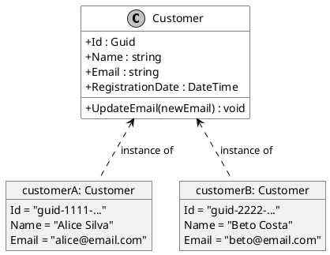

# O que é um Objeto?

Em Programação Orientada a Objetos, se a **Classe** é o conceito abstrato, o molde, a planta baixa, então o **Objeto** é a entidade fundamental, concreta e *viva*. É a materialização de uma classe, uma instância real com a qual podemos interagir. Enquanto a classe é a ideia de um "Cliente", um objeto é um cliente específico: a "Alice Silva", com seu ID, email e data de cadastro únicos.

Um programa orientado a objetos é, em sua essência, uma coleção de objetos que interagem entre si. A execução do software é a história desses objetos sendo criados, tendo seus estados modificados e invocando os comportamentos uns dos outros para atingir um objetivo maior. Sem objetos, uma classe é apenas um plano sem utilidade; sem classes, não há plano para criar objetos.

---

## Diagramando a Relação: Classe vs. Objetos

Um diagrama pode solidificar essa distinção. A classe é o molde único, e os objetos são as múltiplas instâncias distintas criadas a partir dele, cada uma com seus próprios dados.



Este diagrama ilustra perfeitamente que existe **uma** definição (`Customer`) e **múltiplas** instâncias (`customerA`, `customerB`), cada uma com seu próprio estado.

---

## As Duas Características Essenciais de um Objeto

Todo e qualquer objeto em POO é definido por duas características inseparáveis:

1.  **Estado (State)**
    O estado de um objeto é o conjunto de todos os seus dados (armazenados em campos e propriedades) em um determinado momento. É a "memória" do objeto, sua "fotografia" atual. É o que o torna único em relação a outros objetos da mesma classe. 

    > **Dissertação**: O estado é a essência da individualidade de um objeto. Dois objetos da classe `Customer` podem existir, mas é o *estado* — a combinação específica de `Id`, `Name` e `Email` — que os diferencia. `customerA` é a "Alice" e `customerB` é o "Beto". Sem um estado, todos os objetos seriam idênticos e, portanto, inúteis.

2.  **Comportamento (Behavior)**
    O comportamento de um objeto é o conjunto de ações que ele pode executar. Essas ações são definidas pelos **métodos** da sua classe. O mais importante é que o comportamento de um objeto quase sempre existe para visualizar ou, mais comumente, **modificar seu próprio estado**. 

    > **Dissertação**: A forte ligação entre estado e comportamento é o coração do encapsulamento. O método `UpdateEmail()` não é uma função solta no programa; ele é um comportamento do objeto `Customer` que existe especificamente para alterar o estado `Email` *daquele* objeto. O comportamento valida e protege o estado, garantindo que o objeto esteja sempre em uma condição consistente.

---

## Objetos em Código C#: Da Planta à Casa Real

Vamos ver como a teoria se traduz em código C# prático.

### Instanciação: O Poder da Palavra-chave `new`

Para criar um objeto (uma instância) a partir de uma classe, usamos a palavra-chave **`new`**. Esta palavra-chave é uma instrução fundamental que diz ao runtime do .NET para executar três passos:

1.  **Alocar Memória**: Encontrar um bloco de memória na área chamada **Heap** que seja grande o suficiente para armazenar todos os dados de um objeto `Customer`.
2.  **Executar o Construtor**: Chamar o método construtor da classe. A função do construtor é inicializar o objeto, colocando-o em um estado inicial válido e consistente.
3.  **Retornar a Referência**: Devolver o endereço de memória do objeto recém-criado. Esse endereço (e não o objeto em si) é o que será armazenado na sua variável.

### Exemplo Prático: A Classe `Customer`

```c#
// using System; // Required for Guid, DateTime, etc.

public class Customer
{
    // STATE: These properties define the data of a Customer.
    public Guid Id { get; private set; }
    public string Name { get; set; }
    public string Email { get; private set; }
    public DateTime RegistrationDate { get; private set; }

    // CONSTRUCTOR: This method is called by the 'new' keyword to initialize the object.
    public Customer(string name, string email)
    {
        // 'this' refers to the current instance of the object being created.
        this.Id = Guid.NewGuid();
        this.Name = name;
        this.Email = email;
        this.RegistrationDate = DateTime.UtcNow;
    }

    // BEHAVIOR: This method defines an action the object can perform.
    // It modifies the object's own state.
    public void UpdateEmail(string newEmail)
    {
        // In a real system, you would add validation here.
        this.Email = newEmail;
        Console.WriteLine($"Email for customer '{this.Name}' has been updated to '{this.Email}'.");
    }
}

public class CustomerManagement
{
    public static void Main()
    {
        // INSTANTIATION: We use 'new' to create a living object from the Customer class.
        // 'customerA' now holds a reference (a memory address) to the new object.
        Customer customerA = new Customer("Alice Silva", "alice@email.com");

        // We create another, completely separate object.
        Customer customerB = new Customer("Beto Costa", "beto@email.com");

        // INTERACTION: We use the dot (.) operator to access the object's public members.
        Console.WriteLine($"New customer created: {customerA.Name}, ID: {customerA.Id}");
        customerA.UpdateEmail("alice.silva@newdomain.com");
    }
}
```

---

## Aprofundando: Objetos são Tipos de Referência

Este é um dos conceitos técnicos mais importantes em C#. Entendê-lo previne uma classe inteira de bugs.

Em C#, existem duas grandes categorias de tipos: *Tipos de Valor* (`int`, `bool`, `struct`) e *Tipos de Referência* (`class`, `string`, `array`). Objetos são sempre tipos de referência.

-   **Analogia**: Pense na memória do seu computador como uma cidade. O **Heap** é a área residencial, onde as casas (objetos) são construídas. A **Stack** é um caderno de anotações rápido, onde você anota os endereços das casas. Uma variável de objeto (`Customer customerA`) é uma linha no seu caderno (na Stack) que contém apenas o endereço da casa (no Heap).

Quando você atribui uma variável de objeto a outra, você não está construindo uma casa nova. Você está apenas copiando o endereço de um lado para o outro do seu caderno.

```c#
// customer1 is a note on the Stack, holding the address of a new Customer object on the Heap.
Customer customer1 = new Customer("Carlos Dias", "carlos@email.com");

// We are NOT creating a new object here.
// We are just copying the memory address from customer1 to customer2.
// Both variables now point to the exact same object on the Heap.
Customer customer2 = customer1; 

// If we modify the object using one reference...
Console.WriteLine($"Original name for customer1: {customer1.Name}"); // Carlos Dias
customer2.Name = "Carlão";

// ...the change is visible through the other reference, because it's the same object.
Console.WriteLine($"Name for customer1 after change: {customer1.Name}"); // Carlão
```

> **Nota sobre Identidade vs. Igualdade**: Por causa do comportamento de referência, temos dois tipos de "igualdade". **Igualdade de Referência** (`Object.ReferenceEquals(a, b)`) pergunta: "As duas variáveis apontam para o mesmíssimo objeto na memória?". **Igualdade de Valor** (`a.Equals(b)`) pergunta: "Os dois objetos, mesmo que sejam instâncias diferentes, contêm os mesmos valores e são considerados equivalentes?". São conceitos distintos e importantes em cenários mais avançados.

> **Nota sobre `System.Object`**: Em C#, toda e qualquer classe, implícita ou explicitamente, herda de uma classe base universal chamada `System.Object`. Isso significa que todo objeto em C# tem, no mínimo, os comportamentos definidos por `System.Object`, como `Equals()`, `GetHashCode()` e `ToString()`.

---

## Referências Oficiais da Microsoft

-   [Objetos (Guia de Programação C#)](https://learn.microsoft.com/pt-br/dotnet/csharp/fundamentals/object-oriented/objects)
-   [Classes (Guia de Programação C#)](https://learn.microsoft.com/pt-br/dotnet/csharp/fundamentals/object-oriented/classes)
-   [Tipos de Referência (Referência de C#)](https://learn.microsoft.com/pt-br/dotnet/csharp/language-reference/keywords/reference-types)