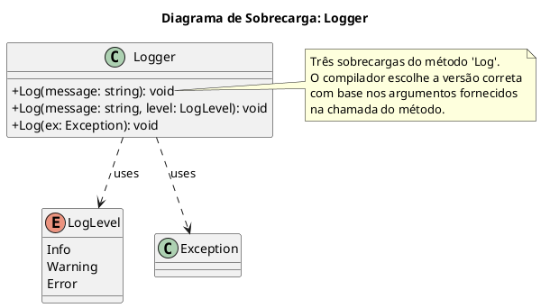

# Sobrecarga de Métodos (Method Overloading)

A **Sobrecarga de Métodos** (em inglês, *Method Overloading*) é um recurso da Programação Orientada a Objetos que permite a uma classe ter **dois ou mais métodos com o mesmo nome**, desde que suas **assinaturas de parâmetros sejam diferentes**.

É uma forma de polimorfismo que acontece em **tempo de compilação** (polimorfismo estático). O compilador do C# é inteligente o suficiente para saber qual versão do método chamar com base nos argumentos que você fornece na chamada.

O principal objetivo da sobrecarga é fornecer maneiras mais flexíveis e intuitivas de se chamar uma mesma operação, sem a necessidade de se inventar nomes diferentes para ações que são conceitualmente idênticas. Ela aumenta a legibilidade e a usabilidade de uma classe.

## As Regras da Sobrecarga

Para que a sobrecarga seja válida, as assinaturas dos métodos devem ser únicas. A assinatura de um método é composta por:

1.  O **nome** do método.
2.  O **número** de parâmetros.
3.  O **tipo** e a **ordem** dos parâmetros.
4.  Os **modificadores** de parâmetro (`ref`, `out`, `in`).

> **Ponto Crítico**: O **tipo de retorno** de um método **NÃO** faz parte de sua assinatura. Você não pode sobrecarregar um método apenas mudando seu tipo de retorno. O compilador não saberia qual deles chamar.

```c#
public class Calculator
{
    // Valid Overloads
    public int Add(int a, int b) { return a + b; }
    public double Add(double a, double b) { return a + b; } // Different parameter types
    public int Add(int a, int b, int c) { return a + b + c; } // Different number of parameters

    // Invalid Overload - COMPILE ERROR!
    // The signature 'Add(int, int)' is already defined.
    // The return type does not differentiate the signature.
    // public double Add(int a, int b) { return (double)(a + b); }
}
```

## Exemplo do Mundo Real: Uma Classe de Log

Um dos exemplos mais clássicos e úteis de sobrecarga é uma classe de logging. Um sistema pode precisar registrar diferentes tipos de informação: uma simples mensagem de texto, uma mensagem com um nível de severidade (Info, Warning, Error) ou um objeto de exceção completo.



### Implementando a Classe `Logger`

```c#
public enum LogLevel
{
    Info,
    Warning,
    Error
}

public class Logger
{
    // Overload 1: For simple string messages. Defaults to Info level.
    public void Log(string message)
    {
        // This overload calls another one to avoid code duplication.
        // This is a very common and recommended practice.
        Log(message, LogLevel.Info);
    }

    // Overload 2: The main overload with message and level.
    public void Log(string message, LogLevel level)
    {
        // In a real system, this would write to a file, database, or console.
        Console.WriteLine($"[{level.ToString().ToUpper()}] - {DateTime.UtcNow} - {message}");
    }

    // Overload 3: For logging exception objects.
    public void Log(Exception ex)
    {
        // This provides a structured way to log exceptions.
        string formattedMessage = $"An exception occurred.\nType: {ex.GetType().Name}\nMessage: {ex.Message}\nStackTrace:\n{ex.StackTrace}";
        Log(formattedMessage, LogLevel.Error);
    }
}

public class Program
{
    public static void Main()
    {
        var logger = new Logger();

        // Calling the first overload: Log(string)
        logger.Log("User logged in successfully.");

        // Calling the second overload: Log(string, LogLevel)
        logger.Log("Database connection is slow.", LogLevel.Warning);

        // Calling the third overload: Log(Exception)
        try
        {
            int x = 10;
            int y = 0;
            int z = x / y;
        }
        catch (Exception ex)
        {
            logger.Log(ex);
        }
    }
}
```

## Sobrecarga de Construtores

O mesmo princípio se aplica a construtores. É extremamente comum sobrecarregar construtores para fornecer diferentes maneiras de inicializar um objeto. Isso torna a classe muito mais flexível.

Uma prática recomendada é usar a palavra-chave `this(...)` para encadear construtores. Isso evita a duplicação da lógica de inicialização e centraliza o trabalho no construtor mais completo.

```c#
public class Customer
{
    public Guid Id { get; private set; }
    public string Name { get; set; }
    public string Email { get; set; }
    public DateTime MemberSince { get; private set; }

    // Overload 1: The most complete constructor. This is the one that does the actual work.
    public Customer(string name, string email)
    {
        Id = Guid.NewGuid();
        Name = name;
        Email = email;
        MemberSince = DateTime.UtcNow;
        Console.WriteLine("Main constructor executed.");
    }

    // Overload 2: A convenience constructor for creating a customer with just an email.
    // It calls the main constructor using 'this(...)', providing a default name.
    public Customer(string email) : this("New Customer", email)
    {
        // This body is executed AFTER the main constructor.
        Console.WriteLine("Email-only constructor finished.");
    }

    // Overload 3: A default constructor.
    // It calls the second constructor, which in turn calls the first one.
    public Customer() : this("default@example.com")
    {
        Console.WriteLine("Default constructor finished.");
    }
}

// Example Usage:
var customer1 = new Customer("John Doe", "john.doe@example.com"); // Calls the main constructor
var customer2 = new Customer("jane.doe@example.com"); // Calls the second, then the main
var customer3 = new Customer(); // Calls the third, then the second, then the main
```

## E as Propriedades? Sobrecarga Através de Indexadores

Como mencionado, propriedades com o mesmo nome não podem ser sobrecarregadas. No entanto, o C# oferece os **Indexadores** (*Indexers*), que permitem que um objeto seja acessado como se fosse um array (usando `[]`). E a grande vantagem é que **indexadores podem ser sobrecarregados**.

Um indexador é declarado de forma parecida com uma propriedade, mas usa a palavra-chave `this` como nome e inclui os parâmetros de índice entre colchetes.

### Exemplo: Uma Coleção de Configurações

Imagine uma classe que armazena as configurações de uma aplicação. Seria útil poder acessar uma configuração tanto pelo seu nome (`string`) quanto pela sua posição na lista (`int`).

```c#
public class AppSettings
{
    private readonly Dictionary<string, string> _settings = new Dictionary<string, string>();
    private readonly List<string> _settingKeys = new List<string>();

    // Indexer Overload 1: Access by string key.
    public string this[string key]
    {
        get 
        {
            return _settings[key];
        }
        set 
        {
            if (!_settings.ContainsKey(key))
            {
                _settingKeys.Add(key);
            }
            _settings[key] = value;
        }
    }

    // Indexer Overload 2: Access by integer index.
    public string this[int index]
    {
        get
        {
            string key = _settingKeys[index];
            return _settings[key];
        }
        // A 'set' accessor could be added here as well.
    }
}

public class Program
{
    public static void Main()
    {
        var settings = new AppSettings();

        // Using the string indexer to set values
        settings["ConnectionString"] = "Server=myServer;Database=myDataBase;";
        settings["Theme"] = "Dark";

        // Using the string indexer to get a value
        Console.WriteLine($"Theme: {settings["Theme"]}");

        // Using the int indexer to get a value by position
        Console.WriteLine($"First setting: {settings[0]}");
    }
}

// Output:
// Theme: Dark
// First setting: Server=myServer;Database=myDataBase;
```

Dessa forma, embora não estejamos sobrecarregando uma propriedade chamada `Setting`, estamos oferecendo múltiplas formas de acessar os dados da classe, que é o espírito da sobrecarga, mas aplicado através do mecanismo de indexadores.

## Conclusão

A sobrecarga de métodos e construtores é uma ferramenta poderosa no arsenal do desenvolvedor C# para criar APIs de classes que são ao mesmo tempo robustas, flexíveis e fáceis de usar. Ao permitir que uma única "ação" (o nome do método) seja invocada de múltiplas maneiras, a sobrecarga reduz a complexidade para quem consome a classe, melhora a legibilidade do código e evita a proliferação de métodos com nomes ligeiramente diferentes para tarefas semelhantes. É um pilar do design de software limpo e expressivo.

> ### Referências Oficiais
> *   **[Sobrecarga de Métodos (Guia de C#)](https://learn.microsoft.com/pt-br/dotnet/csharp/methods#method-overloading)**
> *   **[Construtores (Guia de Programação C#)](https://learn.microsoft.com/pt-br/dotnet/csharp/programming-guide/classes-and-structs/constructors)**

