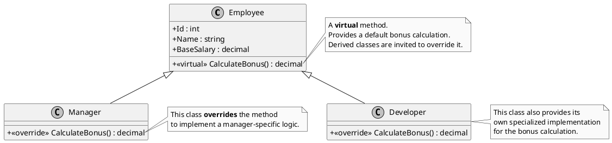

# Sobrescrita de Método: Especializando o Comportamento Herdado

Na Programação Orientada a Objetos (POO), a **Sobrescrita de Método**, ou *Method Overriding*, é um dos pilares que sustentam o polimorfismo. Trata-se de um mecanismo que permite a uma classe derivada (filha) fornecer uma **implementação completamente nova e especializada** para um método que ela herdou de sua classe base (mãe). Em essência, a classe filha declara: "Eu reconheço e respeito o comportamento que herdei, mas para a minha realidade, essa ação específica funciona de uma maneira diferente e mais adequada".

Este mecanismo é a espinha dorsal do **Polimorfismo de Tempo de Execução** (*Runtime Polymorphism*). É o que permite que você trate objetos de diferentes tipos de maneira uniforme, chamando o mesmo método em cada um deles, mas obtendo comportamentos distintos e específicos para o tipo real de cada objeto.

> **Dissertação**: A herança nos oferece o benefício da reutilização de código, estabelecendo um comportamento padrão e uma estrutura comum. No entanto, sem a sobrescrita, a herança seria extremamente rígida e limitada. Teríamos apenas uma única forma de comportamento para toda uma hierarquia de classes, o que raramente reflete a complexidade do mundo real. A **sobrescrita quebra essa rigidez**, infundindo flexibilidade no modelo. Ela nos dá o poder da **especialização**, permitindo que cada classe na hierarquia adapte o comportamento herdado à sua própria necessidade, tornando o design de software imensamente mais poderoso, flexível e expressivo.

---

## A Necessidade de Comportamento Especializado no Mundo Real

Imagine que estamos desenvolvendo um sistema de folha de pagamento para uma empresa. Temos diferentes tipos de funcionários, e o cálculo de bônus varia para cada um. Podemos começar com uma classe base `Employee`.

```c#
// Base class representing a generic employee
public class Employee
{
    public int Id { get; set; }
    public string Name { get; set; }
    public decimal BaseSalary { get; set; }

    // A generic bonus calculation. Let's say 10% of the base salary.
    // We make it VIRTUAL to allow derived classes to change this logic.
    public virtual decimal CalculateBonus()
    {
        return BaseSalary * 0.10m;
    }
}
```

Esta implementação padrão é um bom ponto de partida, mas não serve para todos. Um `Manager` (Gerente), por exemplo, pode ter um bônus que inclui uma porcentagem adicional baseada no desempenho da equipe. Um `Developer` (Desenvolvedor) pode ter um bônus fixo por projeto entregue.

É aqui que a sobrescrita se torna essencial. As classes `Manager` and `Developer` precisam de um comportamento mais específico para o método `CalculateBonus`.

```c#
// Derived class for a Manager
public class Manager : Employee
{
    // The Manager class OVERRIDES the base behavior for bonus calculation.
    public override decimal CalculateBonus()
    {
        // A manager's bonus is 20% of salary + an extra fixed amount.
        return (BaseSalary * 0.20m) + 5000m;
    }
}

// Derived class for a Developer
public class Developer : Employee
{
    // The Developer class also OVERRIDES the base behavior.
    public override decimal CalculateBonus()
    {
        // A developer's bonus is a smaller percentage but with a per-project bonus.
        // For simplicity, let's imagine this value comes from another property.
        decimal projectBonus = 3000m; 
        return (BaseSalary * 0.12m) + projectBonus;
    }
}
```

A mágica do polimorfismo acontece quando processamos uma lista de funcionários. Podemos tratar todos como `Employee`, mas ao chamar `CalculateBonus()`, o C# executa a versão correta do método em tempo de execução, com base no tipo real do objeto.

---

## O Contrato de Sobrescrita: `virtual`, `abstract` e `override`

A sobrescrita não é um processo anárquico. Ela é governada por um contrato claro e estrito entre a classe base e a classe derivada, definido por um trio de palavras-chave: `virtual`, `abstract` e `override`.

1.  **`virtual` - O Convite para Sobrescrever**
    -   **Onde**: Usado em um método na **classe base**.
    -   **O que significa**: "Eu, a classe base, estou fornecendo uma implementação padrão e funcional para este método. No entanto, estou ciente de que minhas classes derivadas podem precisar de um comportamento diferente. Eu as **convido** a fornecerem suas próprias implementações, se desejarem. Isso é totalmente *opcional*." Um método `virtual` **deve** ter um corpo.

2.  **`abstract` - A Obrigação de Sobrescrever**
    -   **Onde**: Usado em um método dentro de uma **classe base `abstract`**.
    -   **O que significa**: "Eu, a classe base, sou um conceito e não sei (ou não devo) implementar este método. No entanto, eu declaro que este comportamento **deve existir** em qualquer classe concreta que herdar de mim. Toda e qualquer classe não-abstrata que me herdar **é obrigada** a fornecer sua própria implementação para este método. Isso é *mandatório*." Um método `abstract` **não tem** corpo, apenas a assinatura.

3.  **`override` - A Nova Implementação**
    -   **Onde**: Usado em um método na **classe derivada**.
    -   **O que significa**: "Eu, a classe filha, estou ciente do convite (`virtual`) ou da obrigação (`abstract`) da minha classe mãe. Eu estou conscientemente e explicitamente fornecendo a minha própria implementação especializada para esse método, substituindo a original."

> **Nota Importante**: Você **não pode** sobrescrever um método que não seja marcado como `virtual` ou `abstract`. Se você tentar, o compilador do C# gerará um erro. Essa regra é uma salvaguarda crucial: ela impede que você altere acidentalmente o comportamento de uma classe de uma forma que o autor original não previu, o que poderia levar a bugs sutis e quebrar a lógica de negócio esperada (uma violação do Princípio de Liskov).

### Diagrama de Contrato (PlantUML)

Vamos visualizar a hierarquia de funcionários:



---

## Interação com Modificadores de Acesso

A sobrescrita também interage com os modificadores de acesso (`public`, `protected`, `internal`). A regra fundamental é:

> **Um método sobrescrito não pode ser menos acessível que o método da classe base.**

Isso garante que o contrato de visibilidade da classe base seja sempre respeitado. Se um método é `public` na base, ele promete ser acessível por qualquer um. A classe filha não pode quebrar essa promessa tornando-o `protected` ou `private`.

-   Um método `public virtual` só pode ser sobrescrito por um método `public override`.
-   Um método `protected virtual` pode ser sobrescrito por `protected override` ou `public override` (aumentando a visibilidade).
-   Um método `private` **não pode** ser `virtual` ou `abstract`, portanto, não pode ser sobrescrito. Ele é, por natureza, "selado" dentro da classe que o declara.

Para uma revisão completa sobre os modificadores, consulte o tópico <a href="Modificators.md">Modificators</a>.

---

## Exemplo Prático: Processando a Folha de Pagamento

Este código implementa a hierarquia de funcionários e demonstra o polimorfismo em ação.

```c#
using System;
using System.Collections.Generic;

// The base class defines the general contract and default behavior.
public class Employee
{
    public int Id { get; set; }
    public string Name { get; set; }
    public decimal BaseSalary { get; set; }

    // VIRTUAL method: provides a default implementation and invites overrides.
    public virtual decimal CalculateBonus()
    {
        Console.WriteLine($"  (Calculating default bonus for {Name})");
        return BaseSalary * 0.10m;
    }
}

// Derived class for Manager.
public class Manager : Employee
{
    // OVERRIDE: provides a specialized implementation.
    public override decimal CalculateBonus()
    {
        Console.WriteLine($"  (Calculating manager-specific bonus for {Name})");
        return (BaseSalary * 0.20m) + 5000m;
    }
}

// Derived class for Developer.
public class Developer : Employee
{
    // OVERRIDE: provides another specialized implementation.
    public override decimal CalculateBonus()
    {
        Console.WriteLine($"  (Calculating developer-specific bonus for {Name})");
        return (BaseSalary * 0.12m) + 3000m;
    }
}

// A simple class to process payments.
public class PayrollProcessor
{
    public static void Main()
    {
        var employees = new List<Employee>
        {
            new Manager { Id = 1, Name = "Alice", BaseSalary = 90000m },
            new Developer { Id = 2, Name = "Bob", BaseSalary = 75000m },
            // This employee will use the default implementation from the Employee class.
            new Employee { Id = 3, Name = "Charlie", BaseSalary = 50000m }
        };

        Console.WriteLine("--- Processing Payroll Bonuses ---");
        foreach (var emp in employees)
        {
            // The magic of polymorphism happens here!
            // The runtime calls the correct version of CalculateBonus()
            // based on the actual type of the object 'emp' refers to.
            decimal bonus = emp.CalculateBonus();
            Console.WriteLine($"Processing bonus for {emp.Name} ({emp.GetType().Name}). Amount: {bonus:C}");
            Console.WriteLine();
        }
    }
}
```

---

## Tópicos Adicionais e Avançados

> **`override` vs. `new` (Ocultação de Método)**: Existe outra palavra-chave, `new`, que pode ser usada em um método de uma classe filha com a mesma assinatura de um método da classe mãe. No entanto, `new` **NÃO sobrescreve** o método; ela apenas o **oculta** (*method hiding*). Isso quebra o polimorfismo. Se um objeto `Manager` for armazenado em uma variável do tipo `Employee`, e o método `CalculateBonus` fosse definido com `new`, a versão da classe `Employee` seria chamada, não a da `Manager`. O uso de `new` é raro, geralmente indica um problema de design e deve ser feito com extremo cuidado. **Sempre prefira `override` para especializar comportamento polimórfico.**

> **`sealed override`**: Você pode "selar" um método sobrescrito para impedir que classes mais abaixo na hierarquia o sobrescrevam novamente. Ex: `public sealed override decimal CalculateBonus() { ... }`. Isso "trava" a implementação naquele ponto da cadeia de herança, finalizando a possibilidade de customização para aquele método.

> **Acessando a Implementação da Classe Base**: Dentro de um método sobrescrito, você pode querer executar a lógica da classe base e depois adicionar algo a mais. Para isso, use a palavra-chave `base`.
> ```c#
> public override decimal CalculateBonus()
> {
>     // First, calculate the standard bonus from the base class.
>     decimal standardBonus = base.CalculateBonus();
>     // Then, add the manager-specific extra amount.
>     return standardBonus + 5000m;
> }
> ```

---

## Referências Oficiais da Microsoft

-   [Polimorfismo (Guia de Programação C#)](https://learn.microsoft.com/pt-br/dotnet/csharp/fundamentals/object-oriented/polymorphism)
-   [Palavra-chave `override` (Referência de C#)](https://learn.microsoft.com/pt-br/dotnet/csharp/language-reference/keywords/override)
-   [Controle de Versão com as Palavras-chave `override` e `new` (Guia de Programação C#)](https://learn.microsoft.com/pt-br/dotnet/csharp/programming-guide/classes-and-structs/versioning-with-the-override-and-new-keywords)
