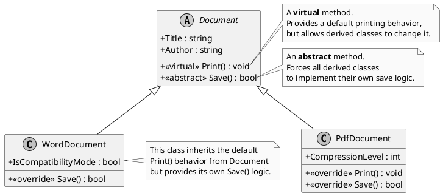

# Sobrescrita de Método (override): Especializando o Comportamento Herdado

A **Sobrescrita de Método**, ou *Method Overriding*, é uma das manifestações mais poderosas da Programação Orientada a Objetos. É o mecanismo que permite a uma classe derivada (filha) fornecer uma **implementação nova e especializada** para um método que ela herdou de sua classe base (mãe). Em essência, a classe filha diz: "Eu reconheço e respeito o comportamento que herdei, mas para mim, essa ação específica funciona de uma maneira diferente e mais adequada".

Este mecanismo é a espinha dorsal do **Polimorfismo de Tempo de Execução**. É o que permite que você chame o mesmo método em diferentes objetos e obtenha comportamentos diferentes, específicos para o tipo real de cada objeto.

> **Dissertação**: A herança nos dá o benefício da reutilização de código, fornecendo um comportamento padrão. A sobrescrita nos dá o poder da **especialização**. Sem a sobrescrita, a herança seria muito limitada. Teríamos apenas uma forma de comportamento para toda uma hierarquia de classes. A sobrescrita quebra essa rigidez, permitindo que cada classe na hierarquia adapte o comportamento herdado à sua própria realidade, tornando o modelo de objetos imensamente mais flexível e expressivo.

---

## A Necessidade de Comportamento Especializado

Imagine que estamos modelando um sistema com animais. Podemos ter uma classe base `Animal`.

```c#
public class Animal
{
    public virtual void MakeSound()
    {
        Console.WriteLine("An animal makes a sound.");
    }
}
```

Esta implementação padrão é genérica. Agora, criamos uma classe `Dog` que herda de `Animal`. Um cachorro não faz um "som de animal"; ele late. A classe `Dog` precisa de um comportamento mais específico.

```c#
public class Dog : Animal
{
    // The Dog class OVERRIDES the base behavior.
    public override void MakeSound()
    {
        Console.WriteLine("Woof! Woof!");
    }
}
```

Da mesma forma, uma classe `Cat` pode sobrescrever o método para miar. A mágica acontece quando usamos o polimorfismo: podemos ter uma lista de `Animal` e, ao chamar `MakeSound()` em cada um, o som correto é produzido em tempo de execução, com base no tipo real do objeto.

---

## O Contrato de Sobrescrita: `virtual`, `abstract` e `override`

A sobrescrita não é um processo anárquico. Ela é governada por um contrato claro entre a classe base e a classe derivada, definido pelas palavras-chave `virtual`, `abstract` e `override`.

1.  **`virtual` - O Convite para Sobrescrever**
    -   **Onde**: Usado em um método na **classe base**.
    -   **O que significa**: "Eu, a classe base, estou fornecendo uma implementação padrão para este método, mas estou ciente de que minhas filhas podem ter uma ideia melhor. Eu as convido a fornecerem suas próprias implementações, se desejarem. Isso é *opcional*."

2.  **`abstract` - A Obrigação de Sobrescrever**
    -   **Onde**: Usado em um método dentro de uma **classe base `abstract`**.
    -   **O que significa**: "Eu, a classe base, sou apenas um conceito e não sei como implementar este método. No entanto, eu declaro que este comportamento existe. Toda e qualquer classe concreta que herdar de mim **é obrigada** a fornecer sua própria implementação para este método. Isso é *mandatório*."

3.  **`override` - A Nova Implementação**
    -   **Onde**: Usado em um método na **classe derivada**.
    -   **O que significa**: "Eu, a classe filha, estou ciente do convite (`virtual`) ou da obrigação (`abstract`) da minha mãe. Eu estou conscientemente fornecendo a minha própria implementação especializada para esse método."

> **Nota Importante**: Você **não pode** sobrescrever um método que não seja `virtual` ou `abstract`. O C# impõe esse contrato para evitar que você altere acidentalmente o comportamento de uma classe de uma forma que o autor original não previu, o que poderia levar a bugs sutis.

### Diagrama de Contrato (PlantUML)

Vamos visualizar um exemplo mais prático: um sistema que processa diferentes tipos de documentos.



---

## Exemplo Prático: Processador de Documentos

Este código implementa a hierarquia do diagrama acima.

```c#
// The abstract base class defines the contract.
public abstract class Document
{
    public string Title { get; set; }

    // This is a VIRTUAL method. It has a default implementation.
    // Derived classes CAN override it, but they don't have to.
    public virtual void Print()
    {
        Console.WriteLine($"Printing document '{this.Title}' to the default printer.");
    }

    // This is an ABSTRACT method. It has no implementation.
    // Derived classes MUST provide their own implementation.
    public abstract bool Save();
}

// A derived class providing its own implementations.
public class PdfDocument : Document
{
    // This class OVERRIDES the Print method to add specific behavior.
    public override void Print()
    {
        Console.WriteLine($"Opening Adobe Reader to print PDF document '{this.Title}'.");
    }

    // This class MUST override the Save method to fulfill the abstract contract.
    public override bool Save()
    {
        Console.WriteLine($"Saving document '{this.Title}' as a PDF file.");
        return true;
    }
}

// Another derived class.
public class WordDocument : Document
{
    // This class does NOT override Print(), so it will use the default
    // implementation from the base Document class.

    // It MUST, however, override the abstract Save method.
    public override bool Save()
    {
        Console.WriteLine($"Saving document '{this.Title}' as a .docx file.");
        return true;
    }
}

public class DocumentProcessor
{
    public static void Main()
    {
        var documents = new List<Document>
        {
            new PdfDocument { Title = "My-Annual-Report" },
            new WordDocument { Title = "My-Secret-Novel" }
        };

        foreach (var doc in documents)
        {
            Console.WriteLine($"--- Processing {doc.GetType().Name}: {doc.Title} ---");
            doc.Print(); // The magic of polymorphism happens here!
            doc.Save();
            Console.WriteLine();
        }
    }
}
```

---

## Tópicos Adicionais e Avançados

> **`override` vs. `new` (Ocultação de Método)**: Existe outra palavra-chave, `new`, que pode ser usada em um método de uma classe filha com a mesma assinatura de um método da classe mãe. No entanto, `new` **NÃO sobrescreve** o método; ela apenas o **oculta**. Isso quebra o polimorfismo. Se um objeto `PdfDocument` for armazenado em uma variável do tipo `Document`, e o método `Print` fosse definido com `new`, a versão da classe `Document` seria chamada, não a da `PdfDocument`. O uso de `new` é raro e deve ser feito com extremo cuidado, pois quase sempre indica um problema de design. **Sempre prefira `override` para especializar comportamento.**

> **`sealed override`**: Você pode "selar" um método sobrescrito para impedir que classes mais abaixo na hierarquia o sobrescrevam novamente. `public sealed override void MyMethod() { ... }`. Isso "trava" a implementação naquele ponto da cadeia de herança.

---

## Referências Oficiais da Microsoft

-   [Polimorfismo (Guia de Programação C#)](https://learn.microsoft.com/pt-br/dotnet/csharp/fundamentals/object-oriented/polymorphism)
-   [Palavra-chave `override` (Referência de C#)](https://learn.microsoft.com/pt-br/dotnet/csharp/language-reference/keywords/override)
-   [Controle de Versão com as Palavras-chave `override` e `new` (Guia de Programação C#)](https://learn.microsoft.com/pt-br/dotnet/csharp/programming-guide/classes-and-structs/versioning-with-the-override-and-new-keywords)