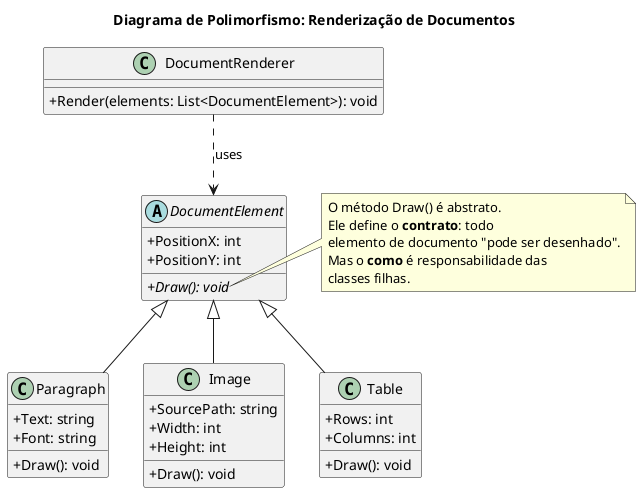

# Polimorfismo: As Muitas Formas do seu Código

**Polimorfismo**, do grego "muitas formas" (*poly* = muitas, *morphos* = formas), é o quarto e talvez o mais poderoso pilar da Programação Orientada a Objetos (OOP). Ele é o princípio que permite que objetos de diferentes classes, que compartilham uma mesma superclasse ou implementam uma mesma interface, respondam à mesma mensagem (chamada de método) de maneiras específicas e diferentes.

Em termos mais simples, o polimorfismo permite que você trate uma variedade de objetos diferentes de maneira uniforme. Você pode ter uma coleção de objetos distintos e chamar o mesmo método em cada um deles, e cada objeto executará a ação de uma forma que faz sentido para ele. É o conceito que dá vida à abstração e à herança.

Vamos usar uma analogia. Pense em um botão "Play" em um controle remoto universal. Este controle pode operar uma TV, um aparelho de Blu-ray e um sistema de som. O botão "Play" é a **interface comum**. 
- Ao apontar para a TV e pressionar "Play", ele pode iniciar a reprodução de um arquivo de mídia via USB.
- Ao apontar para o Blu-ray e pressionar "Play", ele inicia a reprodução do disco.
- Ao apontar para o sistema de som e pressionar "Play", ele começa a tocar uma rádio online.

A ação é a mesma (`Play`), mas o resultado (o comportamento) é diferente dependendo do objeto que recebe o comando. Isso é polimorfismo.

## Como o Polimorfismo Funciona em C#

Em C#, o polimorfismo é tipicamente alcançado através da combinação de **herança** (ou implementação de interface) com **métodos virtuais e sobrescritos**.

Os ingredientes essenciais são:
1.  **Uma classe base (ou interface)** que define um método como `virtual` ou `abstract`. 
    *   `virtual`: O método na classe base tem uma implementação padrão, mas *pode* ser substituído por uma classe derivada.
    *   `abstract`: O método na classe base não tem implementação. Ele *deve* ser implementado por uma classe derivada.
2.  **Uma ou mais classes derivadas** que **sobrescrevem** (`override`) esse método, fornecendo sua própria implementação específica.
3.  **Uma referência da classe base** que aponta para um objeto da classe derivada. É aqui que a mágica acontece: você chama o método através da referência da base, e o .NET runtime determina em tempo de execução qual a implementação correta a ser executada (a da classe derivada).

### Exemplo do Mundo Real: Um Sistema de Renderização de Documentos

Imagine que estamos construindo um editor de texto. Este editor precisa renderizar diferentes elementos em uma página: parágrafos de texto, imagens, tabelas, etc. Cada elemento precisa ser "desenhado" na tela, mas a lógica para desenhar um texto é muito diferente da lógica para desenhar uma imagem.



### Implementando em C#

Primeiro, nossa classe base abstrata `DocumentElement`.

```csharp
// The abstract base class defines the common contract.
public abstract class DocumentElement
{
    public int PositionX { get; set; }
    public int PositionY { get; set; }

    // This is the polymorphic method. It's abstract, so derived classes MUST implement it.
    public abstract void Draw();
}
```

Agora, as classes concretas. Cada uma fornece sua própria implementação para o método `Draw`.

```csharp
public class Paragraph : DocumentElement
{
    public string Text { get; set; }

    // We override the base class method to provide a specific implementation.
    public override void Draw()
    {
        Console.WriteLine($"Drawing a paragraph at ({PositionX},{PositionY}): '{Text}'");
    }
}

public class Image : DocumentElement
{
    public string SourcePath { get; set; }

    public override void Draw()
    {
        Console.WriteLine($"Drawing an image from '{SourcePath}' at ({PositionX},{PositionY}).");
    }
}

public class Table : DocumentElement
{
    public int Rows { get; set; }
    public int Columns { get; set; }

    public override void Draw()
    {
        Console.WriteLine($"Drawing a {Rows}x{Columns} table at ({PositionX},{PositionY}).");
    }
}
```

### A Mágica do Polimorfismo em Ação

O poder do polimorfismo se torna evidente quando temos uma classe que precisa operar sobre esses objetos, como um `DocumentRenderer`. Este renderizador não precisa conhecer os detalhes de `Paragraph`, `Image` ou `Table`. Ele só precisa saber que todos eles são `DocumentElement` e que, portanto, todos têm um método `Draw`.

```csharp
public class DocumentRenderer
{
    // This method accepts a list of ANY object that IS A DocumentElement.
    public void Render(List<DocumentElement> elements)
    {
        Console.WriteLine("--- Starting Document Rendering ---");
        foreach (var element in elements)
        {
            // This is polymorphism!
            // We call the same method, Draw(), on every object.
            // The .NET runtime checks the actual type of 'element' at runtime
            // and calls the correct overridden version of Draw().
            element.Draw();
        }
        Console.WriteLine("--- Document Rendering Finished ---");
    }
}

public class Program
{
    public static void Main()
    {
        // Create a list of different document elements.
        // Note that the list type is of the base class.
        var documentParts = new List<DocumentElement>
        {
            new Paragraph { Text = "This is the first paragraph.", PositionX = 10, PositionY = 20 },
            new Image { SourcePath = "/images/logo.png", PositionX = 10, PositionY = 50 },
            new Table { Rows = 3, Columns = 4, PositionX = 10, PositionY = 150 },
            new Paragraph { Text = "This is a second paragraph, after the image and table.", PositionX = 10, PositionY = 250 }
        };

        var renderer = new DocumentRenderer();
        
        // Pass the list to the renderer.
        // The renderer doesn't know or care about the specific types in the list.
        renderer.Render(documentParts);
    }
}
```

O laço `foreach` dentro do método `Render` é o coração do polimorfismo. A variável `element` é do tipo `DocumentElement`, mas a cada iteração, ela aponta para um objeto de um tipo concreto diferente (`Paragraph`, `Image`, etc.). A chamada `element.Draw()` invoca a versão correta e sobrescrita do método, de acordo com o objeto real na memória naquele momento.

## Benefícios do Polimorfismo

1.  **Extensibilidade**: Podemos adicionar novos tipos de `DocumentElement` (como `Video`, `Chart`, etc.) ao nosso sistema sem precisar mudar **uma linha sequer** da classe `DocumentRenderer`. Basta criar a nova classe, herdar de `DocumentElement` e implementar o método `Draw`. Isso está diretamente ligado ao **Princípio do Aberto/Fechado (Open/Closed Principle)**.

2.  **Código Desacoplado**: O `DocumentRenderer` não está acoplado às implementações concretas. Ele depende apenas da abstração (`DocumentElement`), tornando o sistema mais flexível e fácil de manter.

3.  **Simplicidade**: O código cliente (como o `DocumentRenderer`) se torna muito mais simples. Em vez de ter um `if-else` ou `switch` gigante para tratar cada tipo de elemento, ele simplesmente trata todos da mesma forma.

## Conclusão

O **Polimorfismo** é o que permite que nossas abstrações ganhem vida. Ele nos capacita a escrever código que opera em termos de contratos (classes base ou interfaces) em vez de implementações concretas. Ao fazer isso, criamos sistemas que não são apenas mais fáceis de entender e manter, mas também incrivelmente flexíveis e extensíveis, prontos para se adaptar a novos requisitos com o mínimo de esforço.

> ### Referências Oficiais
> *   **[Polimorfismo (Guia de C#)](https://docs.microsoft.com/pt-br/dotnet/csharp/fundamentals/object-oriented/polymorphism)**
> *   **[Palavras-chave `virtual` e `override`](https://docs.microsoft.com/pt-br/dotnet/csharp/language-reference/keywords/override)**
