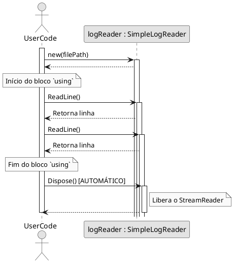

# Gerenciando Recursos com IDisposable

No universo .NET, o **Garbage Collector (GC)**, ou Coletor de Lixo, faz um trabalho fantástico de gerenciar a memória para nós. Ele rastreia os objetos que criamos e, quando não estão mais em uso, libera automaticamente a memória que ocupavam. Esses são os chamados **recursos gerenciados** (*managed resources*).

No entanto, muitos programas precisam interagir com coisas que estão **fora** do controle do ambiente .NET. Estes são os **recursos não gerenciados** (*unmanaged resources*). O Garbage Collector sabe como liberar a memória de um objeto C#, mas ele não tem ideia de como lidar com esses recursos externos. 

Exemplos comuns de recursos não gerenciados incluem:

-   **Conexões de banco de dados** (`SqlConnection`)
-   **Manipuladores de arquivos** (*file handles*, como em `FileStream`)
-   **Conexões de rede** (`Socket`)
-   **Recursos gráficos do sistema operacional** (pincéis, fontes, janelas)
-   **Ponteiros para memória não gerenciada**

### O Problema: Vazamento de Recursos

Se você usa um desses recursos e simplesmente "esquece" o objeto, o GC eventualmente limpará a memória do *objeto C#*, mas o recurso externo pode permanecer "preso". Uma conexão de banco de dados pode ficar aberta no servidor, um arquivo pode ficar bloqueado no sistema operacional. Isso é um **vazamento de recursos** (*resource leak*) e pode esgotar os recursos do sistema, causando lentidão e falhas na aplicação.

> **Dissertação**: O gerenciamento de recursos não gerenciados é uma questão de responsabilidade. É como alugar um carro. A locadora (o sistema operacional ou o banco de dados) lhe entrega as chaves (o *handle* do recurso). Quando você termina de usar o carro, não pode simplesmente abandoná-lo na rua e esperar que alguém o encontre. Você tem a responsabilidade de devolvê-lo à locadora para que ele fique disponível para outros. Se não o fizer, você está bloqueando um recurso valioso. O padrão `Dispose` é o processo formal de "devolver as chaves".

---

## A Solução: O Padrão `Dispose`

Para resolver esse problema, o .NET fornece um contrato simples e poderoso: a interface `IDisposable`.

```c#
public interface IDisposable
{
    void Dispose();
}
```

Uma classe que implementa `IDisposable` está fazendo uma promessa: "Eu gerencio um recurso valioso e finito. Quando você terminar de me usar, você **deve** chamar meu método `Dispose()` para que eu possa liberar esse recurso de forma segura e imediata."

> **Correção de um Mito Comum**: O método `Dispose()` **NÃO** destrói o objeto .NET. A liberação da memória do objeto em si ainda é trabalho do Garbage Collector. A única responsabilidade do `Dispose()` é **liberar o recurso não gerenciado** (fechar a conexão, liberar o arquivo, etc.).

### Implementando `IDisposable`

Vamos criar uma classe simples que lê um arquivo. Ela usará um `StreamReader`, que é um tipo `IDisposable`.

```c#
// Our class uses an IDisposable resource (_reader), so it must also be IDisposable.
public class SimpleLogReader : IDisposable
{
    private readonly StreamReader _reader;

    public SimpleLogReader(string filePath)
    {
        // We take ownership of the StreamReader
        _reader = new StreamReader(filePath);
        Console.WriteLine("Log file opened.");
    }

    public string ReadLine()
    {
        return _reader.ReadLine();
    }

    // This is our implementation of the IDisposable contract.
    public void Dispose()
    {
        // We must release the resource we own.
        _reader?.Dispose();
        Console.WriteLine("Log file closed.");
    }
}
```

---

## `using`: A Forma Segura e Automática de Chamar `Dispose`

O problema de chamar `Dispose()` manualmente é que é fácil esquecer. Pior ainda, se ocorrer uma exceção no meio do código, a chamada ao `Dispose()` pode nunca ser alcançada.

A solução tradicional para isso é um bloco `try...finally`:

```c#
var logReader = new SimpleLogReader("activity.log");
try
{
    Console.WriteLine(logReader.ReadLine());
}
finally
{
    // The finally block is GUARANTEED to execute, even if an exception occurs in the try block.
    logReader.Dispose();
}
```

Isso funciona, mas é verboso. O C# nos dá uma sintaxe muito mais limpa e segura para fazer exatamente a mesma coisa: a declaração `using`.

### A Declaração `using`

A declaração `using` é um "açúcar sintático" para o bloco `try...finally`. Ela garante que `Dispose()` será chamado no objeto assim que o bloco de código terminar, não importa como.

**Sintaxe Clássica (antes do C# 8):**

```c#
// The using statement defines a scope.
using (var logReader = new SimpleLogReader("activity.log"))
{
    Console.WriteLine(logReader.ReadLine());
    Console.WriteLine(logReader.ReadLine());
}
// As soon as the code exits this block, logReader.Dispose() is automatically called.
```

**Sintaxe Moderna (C# 8 e superior):**

No C# 8, a sintaxe foi simplificada para escopos mais amplos. O `Dispose()` é chamado quando a variável sai do escopo atual (normalmente, no final do método).

```c#
public void ProcessLogFile()
{
    // The variable is scoped to the current block (the method).
    using var logReader = new SimpleLogReader("activity.log");

    Console.WriteLine(logReader.ReadLine());
    Console.WriteLine(logReader.ReadLine());

} // logReader.Dispose() is automatically called here, at the end of the method.
```

### Diagrama de Sequência do `using`

Este diagrama mostra o que acontece nos bastidores.



---

## O Padrão `Dispose` Completo (Tópico Avançado)

E se um desenvolvedor esquecer de usar o `using`? O recurso ainda vazaria. Para criar uma rede de segurança, existe um padrão mais robusto que usa um **Finalizador** (também conhecido como destrutor).

Um finalizador (`~NomeDaClasse()`) é um método especial que o Garbage Collector chama em algum momento no futuro, antes de liberar a memória de um objeto. Ele serve como um último recurso para liberar recursos não gerenciados.

> **Nota**: Você só precisa deste padrão complexo se sua classe possui **diretamente** recursos não gerenciados (como ponteiros de memória). Se sua classe apenas contém **outros objetos gerenciados** que são `IDisposable` (como `FileStream` ou `SqlConnection`), a implementação simples mostrada anteriormente é geralmente suficiente.

```c#
public class RobustResourceHolder : IDisposable
{
    private bool _disposed = false; // To prevent redundant calls

    // Constructor
    public RobustResourceHolder()
    {
        // Allocate unmanaged resources here (e.g., memory pointers)
    }

    // The public Dispose method, called by the user.
    public void Dispose()
    {
        // Dispose of both managed and unmanaged resources.
        Dispose(true);
        // Take this object off the finalization queue to prevent finalization code for this object
        // from executing a second time.
        GC.SuppressFinalize(this);
    }

    // The protected virtual method that does the actual work.
    protected virtual void Dispose(bool disposing)
    {
        if (_disposed) return;

        if (disposing)
        {
            // Called from Dispose(). It is safe to dispose managed resources here.
            // e.g., myManagedResource.Dispose();
        }

        // Always dispose unmanaged resources here.
        // e.g., FreeTheUnmanagedMemoryPointer();

        _disposed = true;
    }

    // The finalizer (destructor), called by the GC as a safety net.
    ~RobustResourceHolder()
    {
        // Do not dispose managed resources here, because the GC may have already finalized them.
        // Only dispose unmanaged resources.
        Dispose(false);
    }
}
```

---

## Referências Oficiais da Microsoft

-   [Implementar um método Dispose (Guia de Programação C#)](https://learn.microsoft.com/pt-br/dotnet/standard/garbage-collection/implementing-dispose)
-   [Instrução `using` (Referência de C#)](https://learn.microsoft.com/pt-br/dotnet/csharp/language-reference/statements/using)
-   [Interface `IDisposable`](https://learn.microsoft.com/pt-br/dotnet/api/system.idisposable)
