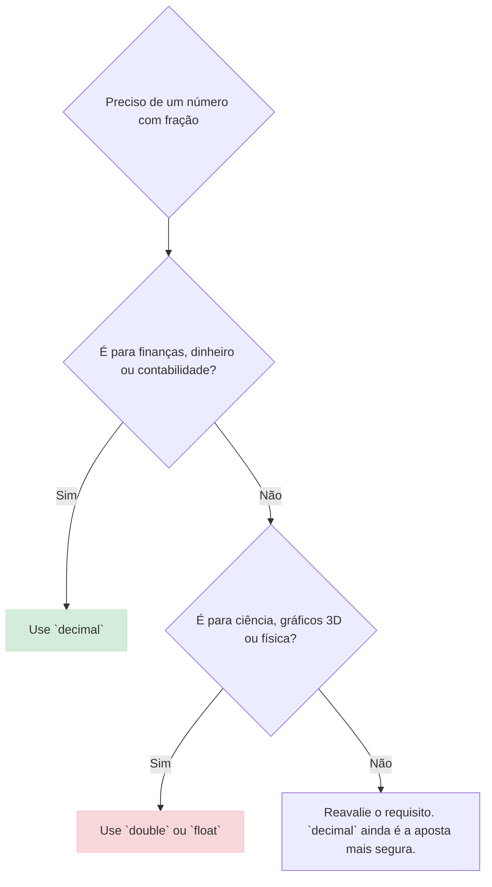

# Valores Monetários

Imagine que você está construindo uma casa de blocos de montar. Para que a casa fique firme, cada bloco precisa se encaixar perfeitamente no outro, sem sobras ou vãos. Se os blocos não tiverem o tamanho exato, a estrutura toda fica bamba e pode desabar.

Na programação, trabalhar com dinheiro é muito parecido. Precisamos de uma representação numérica que seja perfeitamente exata, como os blocos de montar. Usar um tipo de dado impreciso para dinheiro é como usar blocos de tamanhos errados: no final, a conta não fecha.

## O Desafio dos Tipos de Ponto Flutuante (`float` e `double`)

Muitos tipos numéricos, como `float` e `double`, são baseados em representações binárias de "ponto flutuante". Eles são ótimos para cálculos científicos e gráficos, onde uma aproximação minúscula é aceitável.

O problema é que, em binário, é impossível representar com exatidão algumas frações decimais simples, como `0.1` ou `0.2`. Isso leva a pequenos erros de arredondamento que, em cálculos financeiros, se acumulam e causam grandes problemas.

Pense nisso como tentar pagar `R$ 0,30` com moedas que só existem em frações de `1/2`, `1/4`, `1/8`. Você nunca conseguirá o valor exato.

## A Solução: O Tipo `decimal`

Para resolver isso, o C# nos oferece o tipo `decimal`. Ele foi projetado especificamente para cálculos financeiros e monetários.

Diferente do `float` e `double`, o `decimal` armazena os números como uma grande quantidade de dígitos (até 29) e a posição da vírgula decimal. Isso garante que valores como `10.99` ou `0.25` sejam armazenados com exatidão total, sem erros de arredondamento.



**Termo Técnico:**
*   **Ponto Flutuante Binário (`float`, `double`):** Uma forma de representar números com frações usando potências de 2. É rápido, mas pode ser impreciso para valores decimais.
*   **Ponto Flutuante Decimal (`decimal`):** Uma forma de representar números com frações usando potências de 10. É ideal para finanças, pois representa valores decimais com exatidão.

Sempre que for trabalhar com dinheiro, **use `decimal`**.

## Realizando Cálculos e Conversões

Trabalhar com `decimal` é direto. Você pode realizar todas as operações aritméticas padrão.

### Operações Aritméticas

```c#
// The 'm' suffix indicates a decimal literal
decimal productPrice = 19.95m;
decimal shippingCost = 5.50m;
decimal discount = 0.10m; // 10% discount

// Addition
decimal subTotal = productPrice + shippingCost;

// Multiplication and Subtraction
decimal discountValue = subTotal * discount;
decimal finalTotal = subTotal - discountValue;

Console.WriteLine($"Subtotal: {subTotal:C}");
Console.WriteLine($"Discount: {discountValue:C}");
Console.WriteLine($"Final Total: {finalTotal:C}");
```

### Convertendo Texto em `decimal`

Frequentemente, você receberá valores monetários como texto (por exemplo, de um campo de formulário). É crucial converter esse texto de forma segura, para evitar erros caso o usuário digite um valor inválido. Use `decimal.TryParse()` para isso.

```c#
using System.Globalization;

string userInput = "25,50"; // Input might use a comma
decimal parsedValue;

// TryParse will attempt to convert the string to a decimal.
// It returns true if successful and false if it fails.
// We provide a culture to correctly handle the comma as a decimal separator.
bool isSuccess = decimal.TryParse(userInput, NumberStyles.Currency, new CultureInfo("pt-BR"), out parsedValue);

if (isSuccess)
{
    Console.WriteLine($"Successfully parsed. The value is {parsedValue * 2}");
}
else
{
    Console.WriteLine("Invalid input. Please enter a valid number.");
}
```

## Formatando Moeda para Exibição

Depois que os cálculos estiverem corretos, você precisará mostrar o valor para o usuário de uma forma legível. Para isso, usamos o método `ToString("C")` e a classe `CultureInfo`.

**Termo Técnico:**
*   **`CultureInfo`:** Um objeto que contém informações sobre uma cultura específica, como o idioma, o formato de data e hora, e o símbolo da moeda.

```c#
using System.Globalization;

decimal value = 1234.56m;

// Format for Brazil (Real)
var cultureBrazil = new CultureInfo("pt-BR");
Console.WriteLine(value.ToString("C", cultureBrazil)); // Outputs: R$ 1.234,56

// Format for United States (Dollar)
var cultureUSA = new CultureInfo("en-US");
Console.WriteLine(value.ToString("C", cultureUSA)); // Outputs: $1,234.56

// Format for Portugal (Euro)
var culturePortugal = new CultureInfo("pt-PT");
Console.WriteLine(value.ToString("C", culturePortugal)); // Outputs: 1 234,56 €
```

## Recomendações e Boas Práticas

1.  **Sempre use `decimal`:** Para qualquer variável que armazene ou calcule valores monetários.
2.  **Armazene Corretamente no Banco de Dados:** Use tipos de dados equivalentes no seu banco de dados, como `DECIMAL` ou `NUMERIC`. Nunca use `FLOAT` ou `REAL`.
3.  **Evite Conversões Desnecessárias:** Mantenha os valores como `decimal` durante todo o ciclo de vida do cálculo.
4.  **Internacionalização:** Se sua aplicação lida com múltiplas moedas, armazene o código da moeda (ex: "BRL", "USD") junto com o valor.
5.  **Cuidado com o Arredondamento:** Este é um tópico crucial.

### Detalhando o Arredondamento com `Math.Round()`

Cálculos podem gerar mais casas decimais do que o necessário. Use `Math.Round()` para arredondar os valores para o número correto de casas decimais (geralmente 2).

O .NET usa por padrão uma estratégia chamada "Arredondar para o par mais próximo" (`MidpointRounding.ToEven`). Isso significa que, se um número está exatamente no meio (como 2.5), ele será arredondado para o número par mais próximo (2). Isso é estatisticamente mais justo em grandes conjuntos de dados, mas pode não ser o que você espera em um extrato bancário.

Para o arredondamento "comercial" comum, onde `2.5` vira `3`, use `MidpointRounding.AwayFromZero`.

```c#
decimal value1 = 4.255m;
decimal value2 = 4.265m;

// Default rounding (ToEven)
// 4.255 is halfway, rounds to the nearest even number (4.26)
decimal rounded1_even = Math.Round(value1, 2); 
// 4.265 is halfway, rounds to the nearest even number (4.26)
decimal rounded2_even = Math.Round(value2, 2);

Console.WriteLine($"Default Rounding: {value1} -> {rounded1_even}");
Console.WriteLine($"Default Rounding: {value2} -> {rounded2_even}");


// Commercial rounding (AwayFromZero)
// 4.255 rounds away from zero to 4.26
decimal rounded1_away = Math.Round(value1, 2, MidpointRounding.AwayFromZero);
// 4.265 rounds away from zero to 4.27
decimal rounded2_away = Math.Round(value2, 2, MidpointRounding.AwayFromZero);

Console.WriteLine($"AwayFromZero Rounding: {value1} -> {rounded1_away}");
Console.WriteLine($"AwayFromZero Rounding: {value2} -> {rounded2_away}");
```

## Referências

Para aprofundar seus conhecimentos, consulte a documentação oficial da Microsoft:

*   **[Tipo `decimal`](https://learn.microsoft.com/pt-br/dotnet/csharp/language-reference/builtin-types/floating-point-numeric-types)**: Documentação oficial sobre os tipos de ponto flutuante, incluindo `decimal`.
*   **[Classe `Math.Round()`](https://learn.microsoft.com/pt-br/dotnet/api/system.math.round)**: Detalhes sobre os métodos de arredondamento e suas sobrecargas.
*   **[Enum `MidpointRounding`](https://learn.microsoft.com/pt-br/dotnet/api/system.midpointrounding)**: Explicação sobre as diferentes estratégias de arredondamento.
*   **[Cadeias de caracteres de formato numérico padrão](https://learn.microsoft.com/pt-br/dotnet/standard/base-types/standard-numeric-format-strings)**: Guia completo sobre as opções de formatação, incluindo a formatação de moeda ("C").
*   **[Classe `CultureInfo`](https://learn.microsoft.com/pt-br/dotnet/api/system.globalization.cultureinfo)**: Informações sobre como usar culturas para formatar dados de maneira localizada.
