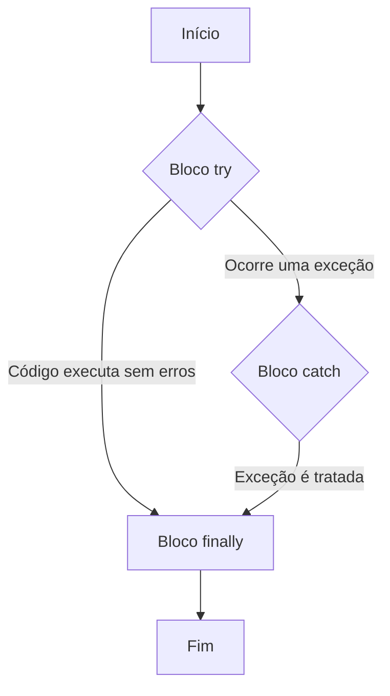

# Exceções em C#

Imagine que você está cozinhando e seguindo uma receita. A receita é o seu programa, uma sequência de passos bem definida. Um dos passos diz: "adicione uma xícara de leite". Você vai até a geladeira, mas descobre que o leite acabou. O que acontece?

- **Sem tratamento de exceções:** Você para tudo. A receita não pode continuar. O jantar está arruinado. No mundo do software, isso é um "crash". O programa para de funcionar abruptamente.
- **Com tratamento de exceções:** A receita, prevendo essa possibilidade, tem uma nota de rodapé: "Se não tiver leite, use creme de leite ou água". Você tem uma alternativa! A receita continua, talvez com um resultado um pouco diferente, mas não falha completamente.

Isso é uma **exceção**: um problema inesperado que ocorre durante a execução de um programa. O tratamento de exceções é o plano que criamos para lidar com esses imprevistos de forma elegante, sem deixar o programa "quebrar".

> Uma exceção é um evento imprevisto (mas que pode ser previsto pelo desenvolvedor) que interrompe o fluxo normal de um programa.

## O Bloco `try-catch`

A principal ferramenta para tratar exceções em C# é o bloco `try-catch`.

- **`try`**: Colocamos dentro deste bloco o código que *pode* lançar uma exceção. É a nossa "tentativa".
- **`catch`**: Este bloco contém o código que será executado *se* uma exceção ocorrer dentro do bloco `try`. É o nosso plano B.

```c#
public void ConvertStringToNumber()
{
    var myString = "abc";
    try
    {
        // We try to convert a string that is not a number.
        // This will throw a FormatException.
        int myInt = int.Parse(myString); 
        Console.WriteLine($"Successfully converted: {myInt}");
    }
    catch (FormatException e)
    {
        // The exception occurred! The program jumps here.
        Console.WriteLine("Error: The input string is not a valid number.");
        Console.WriteLine($"Technical details: {e.Message}");
    }
}
```

No exemplo acima, `int.Parse("abc")` não pode ser executado, então o .NET lança uma `FormatException`. Como o código está dentro de um bloco `try`, a execução normal para e o controle é passado para o bloco `catch` correspondente, que imprime uma mensagem de erro amigável.

## O Bloco `finally`

E se precisarmos executar um código de "limpeza" *independentemente* de uma exceção ter ocorrido ou não? Por exemplo, fechar um arquivo ou uma conexão com o banco de dados. Para isso, usamos o bloco `finally`.

O código dentro do `finally` é sempre executado:
- Se o bloco `try` for concluído com sucesso.
- Se uma exceção for lançada e capturada por um `catch`.

```c#
public void ProcessFile(string filePath)
{
    FileStream file = null;
    try
    {
        file = new FileStream(filePath, FileMode.Open);
        // ... process the file ...
    }
    catch (IOException e)
    {
        Console.WriteLine($"An error occurred while processing the file: {e.Message}");
    }
    finally
    {
        // This block is always executed.
        // We ensure the file is closed to release resources.
        if (file != null)
        {
            file.Close();
            Console.WriteLine("File stream closed.");
        }
    }
}
```

### Diagrama de Fluxo `try-catch-finally`



## Tratando Múltiplas Exceções

Um único bloco `try` pode gerar diferentes tipos de exceções. Podemos ter vários blocos `catch` para tratar cada tipo de erro de uma maneira específica.

```c#
public void ConvertStringToNumber(string input)
{
    try
    {
        int result = int.Parse(input);
        Console.WriteLine($"Success! Result: {result}");
    }
    catch (FormatException)
    {
        // Occurs if the string is not a number (e.g., "abc")
        Console.WriteLine("Error: Input is not a valid number format.");
    }
    catch (OverflowException)
    {
        // Occurs if the number is too large or too small for an int
        Console.WriteLine("Error: The number is too large or too small.");
    }
    catch (Exception ex)
    {
        // A generic catch for any other exception.
        // It's good practice to leave it last.
        Console.WriteLine($"An unexpected error occurred: {ex.Message}");
    }
}
```

## Lançando Exceções com `throw`

Às vezes, nós mesmos precisamos criar e lançar exceções. Isso é útil quando detectamos uma condição de erro que impede nosso método de funcionar corretamente. Usamos a palavra-chave `throw` para isso.

```c#
public void RegisterUser(string username)
{
    if (string.IsNullOrEmpty(username))
    {
        // The username is invalid, so we cannot continue.
        // We throw an exception to signal the error.
        throw new ArgumentNullException(nameof(username), "Username cannot be null or empty.");
    }

    // ... proceed with user registration ...
    Console.WriteLine($"User '{username}' registered.");
}

// Como usar:
try
{
    RegisterUser(null);
}
catch (ArgumentNullException ex)
{
    Console.WriteLine($"Failed to register user. Reason: {ex.Message}");
}
```

## Boas Práticas

1.  **Seja Específico:** Capture os tipos de exceção mais específicos primeiro (`FormatException`, `IOException`) e os mais genéricos (`Exception`) por último.
2.  **Não Capture o que Você Não Pode Resolver:** Se você não sabe o que fazer com uma exceção, é melhor não capturá-la. Deixe que um nível mais acima na "pilha de chamadas" (call stack) a trate.
3.  **Não Use Exceções para Controle de Fluxo:** Exceções são para erros *excepcionais*, não para situações normais. Usá-las para controle de fluxo (como um `if/else`) é muito ineficiente.
4.  **Use `finally` ou `using` para Liberar Recursos:** Sempre garanta que recursos como arquivos, conexões de rede ou de banco de dados sejam liberados. O bloco `using` em C# é uma forma mais concisa e segura de fazer isso para objetos que implementam `IDisposable`.