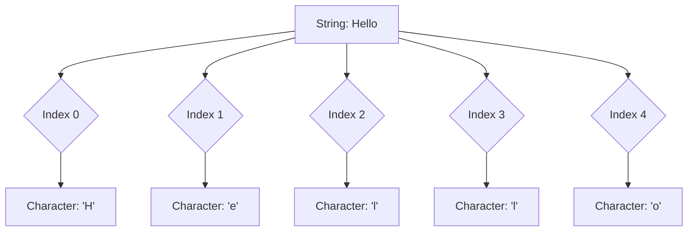

# Índices em Strings

Pense em uma fila de pessoas. Para saber quem é o primeiro, o segundo, e assim por diante, você atribui um número a cada posição. Em programação, as strings funcionam de forma parecida: cada caractere dentro de uma string tem uma posição, e essa posição é chamada de **índice**.

## O que é um Índice?

Um **índice** é um número inteiro que representa a posição de um caractere dentro de uma string. É como o endereço de cada letra. A característica mais importante dos índices na maioria das linguagens de programação (incluindo C#) é que eles são **baseados em zero**.

### Índices Baseados em Zero

Isso significa que:
*   O primeiro caractere de uma string está no índice `0`.
*   O segundo caractere está no índice `1`.
*   O terceiro caractere está no índice `2`.
*   E assim por diante.

Se uma string tem `N` caracteres, o último caractere estará no índice `N-1`.

**Exemplo:**

Para a string `"Hello"`:
*   `H` está no índice `0`
*   `e` está no índice `1`
*   `l` está no índice `2`
*   `l` está no índice `3`
*   `o` está no índice `4`


Este diagrama Mermaid ilustra como os índices são usados para acessar caracteres individuais em uma string. Cada nó representa um passo lógico, mostrando a string original e como cada índice aponta para um caractere específico.



## Acessando Caracteres Usando Índices

Você pode acessar um caractere específico em uma string usando seu índice. Isso é útil quando você precisa trabalhar com uma parte exata do texto.

```csharp
string productName = "Smartphone";
char firstLetter = productName[0]; // Accesses the character at index 0 (S)
char fifthLetter = productName[4]; // Accesses the character at index 4 (t)
char lastLetter = productName[productName.Length - 1]; // Accesses the last character (e)

Console.WriteLine($"First letter: {firstLetter}"); // Output: First letter: S
Console.WriteLine($"Fifth letter: {fifthLetter}"); // Output: Fifth letter: t
Console.WriteLine($"Last letter: {lastLetter}"); // Output: Last letter: e
```

## Encontrando o Índice de um Substring (`IndexOf`)

Frequentemente, você precisará saber onde uma sequência de caracteres (uma **substring**) começa dentro de uma string maior. O método `IndexOf()` é usado para isso. Ele retorna o índice da primeira ocorrência da substring que você está procurando.

*   Se a substring for encontrada, ele retorna o índice inicial da primeira ocorrência.
*   Se a substring não for encontrada, ele retorna `-1`.

```csharp
string emailAddress = "user.name@example.com";

// Finding the index of the '@' symbol
int atSymbolIndex = emailAddress.IndexOf("@");
Console.WriteLine($"'@' symbol found at index: {atSymbolIndex}"); // Output: '@' symbol found at index: 9

// Finding the index of ".com"
int dotComIndex = emailAddress.IndexOf(".com");
Console.WriteLine($"'.com' found at index: {dotComIndex}"); // Output: '.com' found at index: 16

// Trying to find a substring that doesn't exist
int notFoundIndex = emailAddress.IndexOf("xyz");
Console.WriteLine($"'xyz' found at index: {notFoundIndex}"); // Output: 'xyz' found at index: -1

// Using the index to extract a part of the string
// For example, extracting the domain name
if (atSymbolIndex != -1)
{
    string domain = emailAddress.Substring(atSymbolIndex + 1);
    Console.WriteLine($"Domain: {domain}"); // Output: Domain: example.com
}
```

## `LastIndexOf()`: Encontrando a Última Ocorrência

Se você precisar encontrar a última ocorrência de um caractere ou substring, pode usar o método `LastIndexOf()`. Ele funciona de forma semelhante ao `IndexOf()`, mas busca do final para o início da string.

```csharp
string filePath = "/home/user/documents/report.pdf";

// Finding the index of the last '/' to get the file name
int lastSlashIndex = filePath.LastIndexOf("/");
Console.WriteLine($"Last slash found at index: {lastSlashIndex}"); // Output: Last slash found at index: 20

if (lastSlashIndex != -1)
{
    string fileName = filePath.Substring(lastSlashIndex + 1);
    Console.WriteLine($"File Name: {fileName}"); // Output: File Name: report.pdf
}
```

Compreender os índices é fundamental para manipular e extrair informações de strings de forma eficaz em qualquer aplicação.