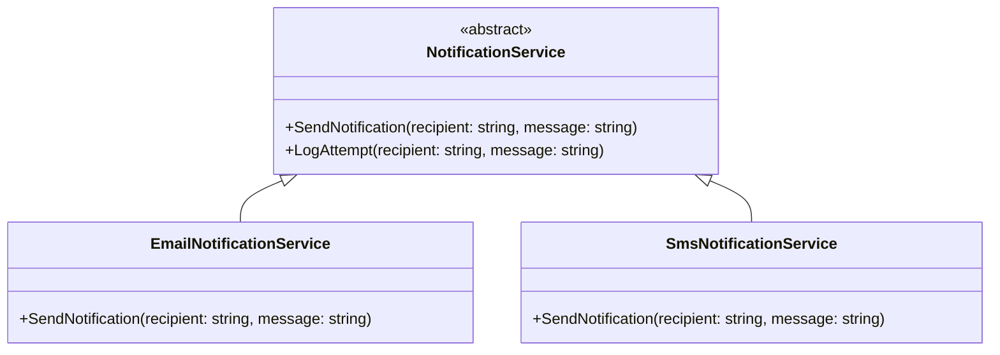

# 2. Abstração

A abstração, no contexto da Programação Orientada a Objetos (OOP), concentra-se em focar no "o quê" (a funcionalidade) em vez do "como" (os detalhes de implementação). É o processo de ocultar a complexidade interna de um sistema ou componente, apresentando apenas a funcionalidade essencial ao usuário ou a outros componentes. Em C#, a abstração é frequentemente alcançada por meio de classes abstratas e interfaces, que definem um contrato de comportamento sem especificar a implementação completa desse comportamento.

**Exemplo em C# (Classes `NotificationService`, `EmailNotificationService`, `SmsNotificationService`):**

Neste exemplo, uma classe abstrata `NotificationService` foi criada para definir um contrato comum para diferentes tipos de serviços de notificação. Ela declara o método abstrato `SendNotification`, que deve ser implementado por qualquer subclasse concreta. Além disso, a classe abstrata inclui um método concreto `LogAttempt`, que é um comportamento comum a todas as notificações, independentemente do seu tipo específico de envio. Essa abordagem permite que diferentes tipos de serviços de notificação (como `EmailNotificationService` e `SmsNotificationService`) sejam utilizados de forma genérica, sem que o código cliente precise conhecer os detalhes específicos de como cada notificação é enviada. A abstração garante uma interface consistente e simplifica a interação com os serviços de notificação.

```c#
// Abstraction: Notification Service
public abstract class NotificationService // Classe abstrata que define um contrato para serviços de notificação.
{
    public abstract void SendNotification(string recipient, string message); // Método abstrato que deve ser implementado pelas subclasses.

    public void LogAttempt(string recipient, string message) // Método concreto, comum a todas as notificações.
    {
        Console.WriteLine($"Attempting to send notification to {recipient}: '{message}'");
    }
}

public class EmailNotificationService : NotificationService // Implementação concreta para envio de e-mail.
{
    public override void SendNotification(string recipient, string message)
    {
        LogAttempt(recipient, message);
        Console.WriteLine($"Sending email to {recipient}: {message}");
        // Aqui estaria a lógica real para enviar um e-mail.
    }
}

public class SmsNotificationService : NotificationService // Implementação concreta para envio de SMS.
{
    public override void SendNotification(string recipient, string message)
    {
        LogAttempt(recipient, message);
        Console.WriteLine($"Sending SMS to {recipient}: {message}");
        // Aqui estaria a lógica real para enviar um SMS.
    }
}
```

