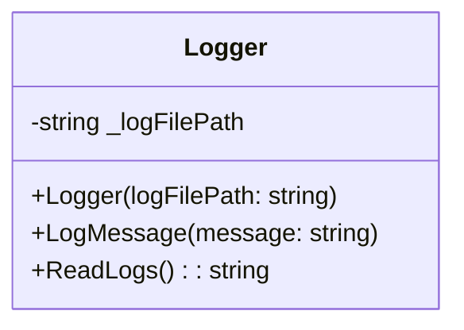

# 1. Encapsulamento

O encapsulamento é um dos pilares fundamentais da Programação Orientada a Objetos (OOP), focado na proteção dos dados internos de um objeto. Ele controla como esses dados podem ser acessados e modificados, garantindo a integridade e a consistência do estado do objeto. Essencialmente, o encapsulamento empacota os dados (atributos) e os métodos (comportamentos) que operam sobre esses dados em uma única unidade, a classe, e restringe o acesso direto a alguns de seus componentes. Isso simplifica o uso da classe, pois os detalhes de implementação são ocultados do usuário.

**Exemplo em C# (Classe `Logger`):**

Neste exemplo prático, a classe `Logger` demonstra o encapsulamento. O caminho do arquivo de log (`_logFilePath`) é um detalhe interno e privado, inacessível diretamente de fora da classe. Métodos públicos como `LogMessage` e `ReadLogs` são fornecidos para interagir com o sistema de log. A forma como as mensagens são armazenadas e lidas do arquivo é completamente encapsulada dentro da classe `Logger`. Isso significa que qualquer componente externo que utilize a classe `Logger` não precisa se preocupar com os detalhes de implementação subjacentes, como a manipulação de arquivos, garantindo uma interface limpa e segura.

```c#
// Encapsulation: Logger
public class Logger
{
    private readonly string _logFilePath; // Encapsula o caminho do arquivo de log, tornando-o privado.

    public Logger(string logFilePath)
    {
        _logFilePath = logFilePath;
    }

    public void LogMessage(string message)
    {
        try
        {
            // A lógica interna para escrever no arquivo é encapsulada aqui.
            File.AppendAllText(_logFilePath, $"[{DateTime.Now}] {message}\n");
            Console.WriteLine($"Logged: {message}");
        }
        catch (Exception ex)
        {
            Console.WriteLine($"Error logging message: {ex.Message}");
        }
    }

    public string ReadLogs()
    {
        try
        {
            if (File.Exists(_logFilePath))
            {
                return File.ReadAllText(_logFilePath);
            }
            return "Log file does not exist.";
        }
        catch (Exception ex)
        {
            return $"Error reading logs: {ex.Message}";
        }
    }
}
```



