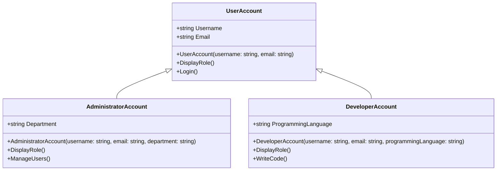

# 3. Herança

A herança é um dos pilares mais poderosos da Programação Orientada a Objetos (OOP), pois permite a reutilização de código e a criação de uma hierarquia de classes. Através da herança, uma nova classe, conhecida como classe derivada ou subclasse, pode adquirir as propriedades (atributos) e comportamentos (métodos) de uma classe existente, chamada classe base ou superclasse. Isso elimina a necessidade de reescrever o código comum para classes relacionadas, promovendo a modularidade e a manutenibilidade do software.

**Exemplo em C# (Classes `UserAccount`, `AdministratorAccount`, `DeveloperAccount`):**

Neste exemplo, diferentes tipos de contas de usuário foram modelados para ilustrar o conceito de herança. A classe `UserAccount` serve como a classe base, contendo propriedades e métodos que são comuns a todos os usuários, como `Username`, `Email` e o método `Login`. As classes `AdministratorAccount` e `DeveloperAccount` herdam de `UserAccount`, o que significa que elas automaticamente adquirem todas as funcionalidades da classe base. Além disso, cada classe derivada adiciona comportamentos específicos (`ManageUsers` para administradores, `WriteCode` para desenvolvedores) e propriedades (`Department`, `ProgrammingLanguage`) que são relevantes para seu papel. O método `DisplayRole` é sobrescrito em cada subclasse para personalizar a exibição do papel de cada tipo de conta, demonstrando como o comportamento pode ser especializado em classes derivadas.

```c#
// Inheritance: User Accounts
public class UserAccount // Classe base para todos os tipos de contas de usuário.
{
    public string Username { get; set; }
    public string Email { get; set; }

    public UserAccount(string username, string email)
    {
        Username = username;
        Email = email;
    }

    public virtual void DisplayRole() // Método virtual que pode ser sobrescrito pelas subclasses.
    {
        Console.WriteLine($"User: {Username}, Email: {Email}");
    }

    public void Login() // Método comum a todas as contas de usuário.
    {
        Console.WriteLine($"{Username} logged in.");
    }
}

public class AdministratorAccount : UserAccount // AdministratorAccount herda de UserAccount.
{
    public string Department { get; set; }

    public AdministratorAccount(string username, string email, string department) : base(username, email) // Chama o construtor da classe base.
    {
        Department = department;
    }

    public override void DisplayRole() // Sobrescreve o método DisplayRole para administradores.
    {
        Console.WriteLine($"Administrator: {Username}, Email: {Email}, Dept: {Department}");
    }

    public void ManageUsers() // Método específico de administradores.
    {
        Console.WriteLine($"Administrator {Username} is managing users.");
    }
}

public class DeveloperAccount : UserAccount // DeveloperAccount herda de UserAccount.
{
    public string ProgrammingLanguage { get; set; }

    public DeveloperAccount(string username, string email, string programmingLanguage) : base(username, email)
    {
        ProgrammingLanguage = programmingLanguage;
    }

    public override void DisplayRole() // Sobrescreve o método DisplayRole para desenvolvedores.
    {
        Console.WriteLine($"Developer: {Username}, Email: {Email}, Lang: {ProgrammingLanguage}");
    }

    public void WriteCode() // Método específico de desenvolvedores.
    {
        Console.WriteLine($"Developer {Username} is writing code in {ProgrammingLanguage}.");
    }
}
```



