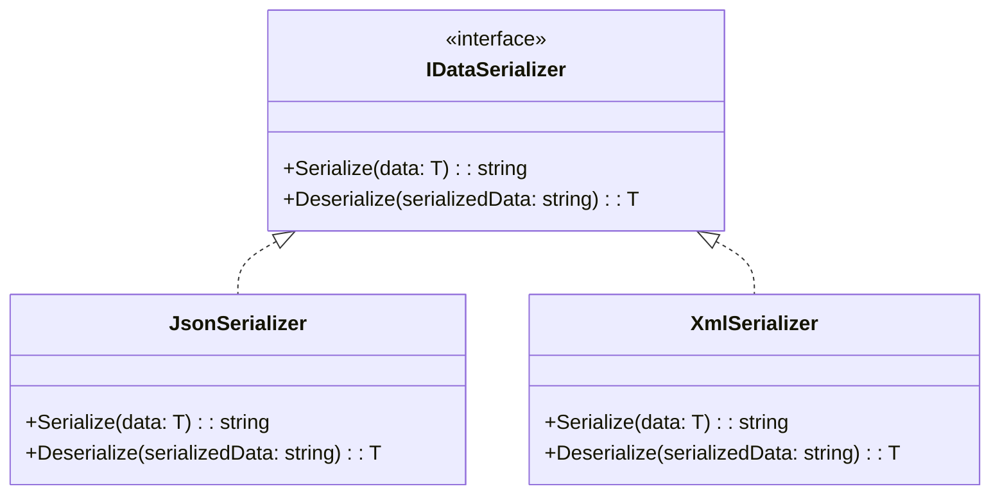

# 4. Polimorfismo

Polimorfismo, que significa "muitas formas", é a capacidade de um objeto assumir múltiplas formas. Na prática, este
pilar da Programação Orientada a Objetos (OOP) permite que objetos de diferentes classes sejam tratados de maneira
uniforme, desde que compartilhem uma classe base comum ou implementem a mesma interface. Isso é fundamental para
escrever código flexível, extensível e de fácil manutenção, pois permite que um único ponto de interação lide com
diversas implementações de forma transparente.

**Exemplo em C# (Interfaces `IDataSerializer`, `JsonSerializer`, `XmlSerializer`):**

Neste exemplo, foi definida uma interface `IDataSerializer` que estabelece um contrato para serializar e desserializar
dados. Em seguida, foram criadas duas implementações concretas dessa interface: `JsonSerializer` e `XmlSerializer`.
Ambas as classes aderem ao contrato da `IDataSerializer`, mas a forma como realizam a serialização e a desserialização
dos dados é intrinsecamente diferente. Isso demonstra o polimorfismo em ação: é possível utilizar qualquer um dos
serializadores de forma intercambiável através da interface `IDataSerializer`. Por exemplo, ao ter uma lista de objetos
do tipo `IDataSerializer` e chamar o método `Serialize` em cada um, o comportamento correto (serialização JSON ou XML)
será executado dinamicamente em tempo de execução, sem a necessidade de verificar o tipo concreto de cada objeto.

```c#
// Polymorphism: Data Serializers
public interface IDataSerializer // Interface que define o contrato para serializadores de dados.
{
    string Serialize<T>(T data);
    T Deserialize<T>(string serializedData);
}

public class JsonSerializer : IDataSerializer // Implementação para serialização JSON.
{
    public string Serialize<T>(T data)
    {
        Console.WriteLine($"Serializing data to JSON...");
        // Em uma aplicação real, seria usada uma biblioteca como System.Text.Json ou Newtonsoft.Json.
        return ${"{{ \"type\": \"{typeof(T).Name}\", \"data\": \"{data.ToString()}\" }}"};
    }

    public T Deserialize<T>(string serializedData)
    {
        Console.WriteLine($"Deserializing data from JSON...");
        // Em uma aplicação real, seria usada uma biblioteca para analisar JSON.
        return default(T);
    }
}

public class XmlSerializer : IDataSerializer // Implementação para serialização XML.
{
    public string Serialize<T>(T data)
    {
        Console.WriteLine($"Serializing data to XML...");
        // Em uma aplicação real, seria usada uma biblioteca como System.Xml.Serialization.
        return $"<root><type>{typeof(T).Name}</type><data>{data.ToString()}</data></root>";
    }

    public T Deserialize<T>(string serializedData)
    {
        Console.WriteLine($"Deserializing data from XML...");
        // Em uma aplicação real, seria usada uma biblioteca para analisar XML.
        return default(T);
    }
}
```


